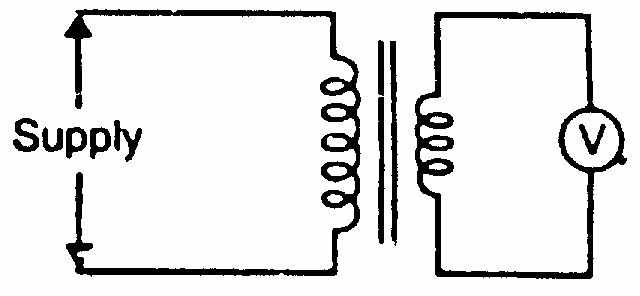
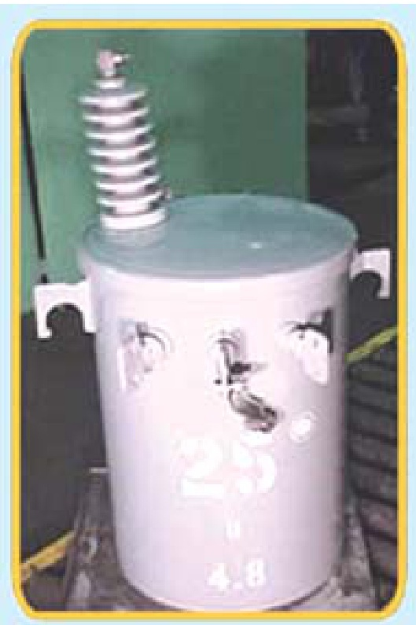

[← T-10: Auto-Transformer](T-10_Auto-Transformer.md) | [🏠 Index](README.md) | [T-12: Rotating Magnetic Field →](T-12_Rotating_Magnetic_Field.md)

---

# T-11: Miscellaneous Transformer Topics

**ECE 2207 — Exam-Style Answers (Sorted by Topic)**

> **Topic Overview:** This document compiles all semester final questions and exam-style answers on **Miscellaneous Transformer Topics** from 7 years of exams (2017–2024).
> Repeated questions appear once with all exam appearances noted.

---

### [2017 Q7(c)]
> 📋 **Appeared in:** 2017 Q7(c)

**(c) 18 kVA, 20000/480V, 60 Hz transformer. Can it safely supply 15 kVA at 415V load at 50 Hz? [04]**

**Key consideration:** The transformer is rated at 60 Hz. If used at 50 Hz:

The EMF equation: $E = 4.44 f N \Phi_m$. For the same applied voltage $V_1 = 20000$ V but $f = 50$ Hz instead of 60 Hz:

$$\Phi_m \propto \frac{V}{f}$$

At 50 Hz: $\Phi_{m,50} = \Phi_{m,60} \times \frac{60}{50} = 1.2 \times \Phi_{m,60}$

The flux increases by 20%. This pushes the core deeper into saturation, increasing magnetizing current and core losses (hysteresis loss increases with $B_m^{1.6}$, eddy loss with $B_m^2$).

**Secondary voltage at 50 Hz:** $V_2$ remains 480 V; to keep rated flux at 50 Hz the primary must be derated to $20000 \times 50/60 = 16.7$ kV, which gives $V_2 = 400$ V.

**kVA rating:** The winding insulation and conductor current ratings are unchanged by frequency. So 18 kVA can still be carried thermally.

**Conclusion:** The transformer **can** supply the 15 kVA load (well below 18 kVA rating) at roughly 415 V secondary. But core losses will be higher due to increased flux. Monitor temperature carefully. **Yes, it can supply 15 kVA safely, but core losses will be elevated.**

---

### [2017 Q8(a)]
> 📋 **Appeared in:** 2017 Q8(a)

**(a) What is an instrument transformer? Explain the Potential Transformer (PT) in brief. [03]**

**Instrument transformer:** A transformer designed specifically to scale high voltages or currents down to safe, measurable levels for instruments (voltmeters, ammeters, energy meters, relays). They provide electrical isolation between the high-power circuit and the measuring instruments.

Two types: Potential Transformer (PT) for voltage measurement, Current Transformer (CT) for current measurement.

**Potential Transformer (PT):**
A step-down transformer. Primary is connected to the high-voltage circuit. Secondary (usually rated 110V) is connected to the voltmeter or relay. The high-voltage side is insulated to withstand the line voltage. Actual voltage $= $ voltmeter reading $\times$ PT ratio. The secondary must never be short-circuited (unlike CT).

---

### [2017 Q8(b)]
> 📋 **Appeared in:** 2017 Q8(b)

**(b) What happens when a transformer is first connected to the power line? Can it be mitigated? [04]**

**Inrush current (magnetizing inrush):**
When a transformer is first energized, a large transient current called inrush current flows, which can be 8–15 times the rated full-load current.

**Why it happens:** At the instant of switching, the core may have residual (remnant) flux. If switching happens at voltage zero crossing with maximum residual flux, the required flux to balance the voltage drives the core deep into saturation. Saturated core has very low inductance, so current spikes to very large values. The inrush decays over a few cycles as core flux settles.

**Mitigation:**
1. **Pre-insertion resistors:** Insert resistance in series with the primary at switching; bypass after a few cycles.
2. **Controlled switching:** Use circuit breakers with closing-angle control to switch at the voltage peak (minimizes flux offset).
3. **Soft starting relays:** Monitor waveform asymmetry (inrush has DC offset) to distinguish from fault current.

---

### [2018 Q1(a)]
> 📋 **Appeared in:** 2018 Q1(a)

**(a) Classify transformer at a glance. [02]**

**By voltage:**
- Step-up (secondary voltage > primary voltage, $N_2 > N_1$)
- Step-down (secondary voltage < primary voltage, $N_2 < N_1$)

**By construction:**
- Core type (windings surround the core)
- Shell type (core surrounds the windings)

**By number of windings:**
- Two-winding transformer
- Auto-transformer (one winding with a tap)
- Three-winding transformer

**By cooling:**
- Oil-immersed (ONAN, ONAF, OFAF)
- Dry-type (air-cooled)

**By application:**
- Power transformer (generation and transmission)
- Distribution transformer (consumer supply)
- Instrument transformer (CT, PT for measurement)

---

### [2018 Q1(b)]
> 📋 **Appeared in:** 2018 Q1(b)

**(b) Describe the effect of frequency and flux on a transformer. [02]**

From the EMF equation: $E = 4.44 f N \Phi_m$

**Effect of frequency:** If supply voltage $V_1$ is held constant and frequency $f$ increases, then $\Phi_m$ must decrease (since $V_1 \approx E_1 = 4.44 f N_1 \Phi_m$). Lower flux means lower iron losses and lower magnetizing current. But leakage reactance $X = 2\pi f L$ increases with frequency, causing more reactive voltage drop.

**Effect of flux (change in voltage):** If supply voltage increases, $\Phi_m$ increases proportionally. This increases both hysteresis loss ($\propto B_m^{1.6}$) and eddy current loss ($\propto B_m^2$). Core may saturate if flux exceeds the design limit, causing large magnetizing current and distorted waveform.

---

### [2020 Q3(a)]
> 📋 **Appeared in:** 2020 Q3(a)

**(a) Why are transformers rated in kVA? [02]**

Transformer losses are:
1. **Iron (core) loss:** Depends on supply voltage only. Independent of load current.
2. **Copper loss:** Depends on current squared ($I^2R$). Depends on load current, not on load power factor.

The total loss, and hence temperature rise and efficiency, depend on voltage and current: not on the power factor of the load. Since different loads connected to the same transformer have different power factors, the transformer can handle a given $V \times I$ product regardless of whether the load is resistive, inductive, or capacitive. So its rating is expressed in volt-amperes (VA or kVA), not in watts (kW).

---

### [2024 Q1(a)]
> 📋 **Appeared in:** 2024 Q1(a)

**(a) Enlist some practical applications of transformer. [Marks: 02, CO: 1]**

1. **Step-up in generating stations:** raise generator voltage to a high value for economical transmission (lower $I^2R$ loss).
2. **Step-down in receiving substations:** reduce the transmission voltage to distribution levels for consumer use.
3. **Interconnecting two systems of different voltages** (e.g. 400 kV with 345 kV) using auto-transformers.
4. **Voltage matching for instruments:** potential transformer for voltmeters, current transformer for ammeters and relays. They also give electrical isolation.
5. **Furnace and welding supplies:** arc-furnace and spot-welding transformers give the large low-voltage, high-current supply needed.
6. **Frequency/voltage control:** variacs in laboratories, and stabilizers for sensitive equipment.

---

[← T-10: Auto-Transformer](T-10_Auto-Transformer.md) | [🏠 Index](README.md) | [T-12: Rotating Magnetic Field →](T-12_Rotating_Magnetic_Field.md)
