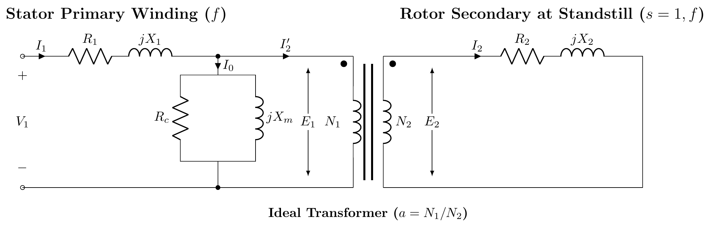
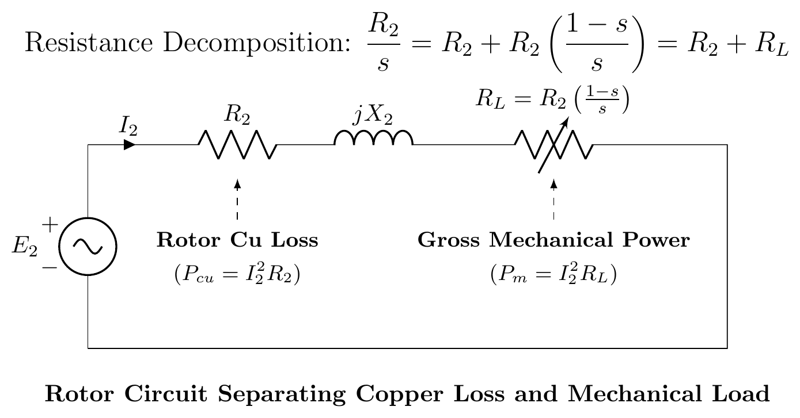

# T-15: IM Equivalent Circuit

**ECE 2207 — Exam-Style Answers (Sorted by Topic)**

> **Topic Overview:** This document compiles all semester final questions and exam-style answers on **IM Equivalent Circuit** from 7 years of exams (2017–2024).
> Repeated questions appear once with all exam appearances noted.

---

### [2017 Q3(a) / 2020 Q5(c)]
> 📋 **Appeared in:** 
> - **2017 Q3(a)**: *"Draw the step-by-step equivalent circuit of a 3-φ induction motor. [03]"*
> - **2020 Q5(c)**: *"How can the equivalent circuit model of an induction motor be obtained? [06]"*

**1. Stator Model and Standstill Rotor ($s=1$):**
At standstill, the motor acts like a transformer. Stator has $R_1, X_1$ and shunt branch $R_c, X_m$. Rotor has $R_2$ and $X_2$ at frequency $f$.

**2. Rotor at Running Slip $s$:**
Rotor frequency is $sf$, induced EMF is $sE_2$, and reactance is $sX_2$.
$$I_2 = \frac{sE_2}{R_2 + jsX_2}$$

**3. Frequency Transformation:**
Divide the current equation by $s$ to refer the rotor to stator frequency $f$:
$$I_2 = \frac{E_2}{R_2/s + jX_2}$$
The rotor resistance is modeled as a variable resistance $R_2/s$.

**4. Power Separation:**
Split $R_2/s$ into actual copper loss and mechanical load components:
$$\frac{R_2}{s} = R_2 + R_2\left(\frac{1-s}{s}\right)$$
$R_2$ causes heat ($P_{cu}$), and $R_L = R_2(1-s)/s$ represents gross mechanical power ($P_m$).

**5. Exact Equivalent Circuit (Referred to Stator):**
Refer rotor parameters to stator using turns ratio $a = N_1/N_2$:
$$R_2' = a^2R_2, \quad X_2' = a^2X_2, \quad R_L' = R_2'\left(\frac{1-s}{s}\right)$$

**6. Approximate Equivalent Circuit:**
Since stator voltage drop is small, the shunt branch can be shifted to the input terminals.

