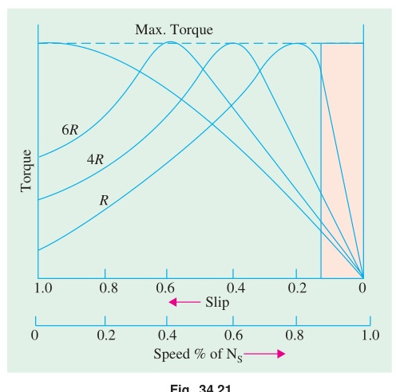

[← T-15: IM Equivalent Circuit](T-15_IM_Equivalent_Circuit.md) | [🏠 Index](README.md) | [T-17: Power Flow & Rotor Power →](T-17_Power_Flow_and_Rotor_Power.md)

---

# T-16: Torque Equations & Characteristics

**ECE 2207 — Exam-Style Answers (Sorted by Topic)**

> **Topic Overview:** This document compiles all semester final questions and exam-style answers on **Torque Equations & Characteristics** from 7 years of exams (2017–2024).
> Repeated questions appear once with all exam appearances noted.

---

### [2017 Q2(b)]
> 📋 **Appeared in:** 2017 Q2(b)

**(b) For full load and maximum torque show: $\frac{T_f}{T_{\max}} = \frac{2as_f}{a^2 + s_f^2}$ where $a = s_{mT}$. [03]**

Torque at any slip:
$$T = \frac{ksE_2^2 R_2}{R_2^2 + s^2 X_2^2}$$

Maximum torque (at $s_{mT} = R_2/X_2 = a$):
$$T_{\max} = \frac{kE_2^2}{2X_2}$$

Full load torque at slip $s_f$:
$$T_f = \frac{ks_f E_2^2 R_2}{R_2^2 + s_f^2 X_2^2}$$

Taking ratio $T_f / T_{\max}$ and substituting $a = R_2/X_2$:

$$\frac{T_f}{T_{\max}} = \frac{ks_f E_2^2 R_2 / (R_2^2 + s_f^2 X_2^2)}{kE_2^2 / (2X_2)}$$

$$= \frac{s_f R_2 \cdot 2X_2}{R_2^2 + s_f^2 X_2^2} = \frac{2s_f (R_2/X_2)}{(R_2/X_2)^2 + s_f^2} = \boxed{\frac{2as_f}{a^2 + s_f^2}}$$
*(Shown)*

---

### [2017 Q2(d)]
> 📋 **Appeared in:** 2017 Q2(d), 2019 Q8(c) (Years: 2017, 2019)

**(d) 8-pole, 50 Hz, full load slip = 2%, $R_2 = 0.001\,\Omega$, $X_2 = 0.005\,\Omega$. Find: (i) $T_{\max}/T_f$ ratio, (ii) speed at maximum torque. [03]**

**Given:** $P = 8$, $f = 50$ Hz, $s_f = 0.02$, $R_2 = 0.001\,\Omega$, $X_2 = 0.005\,\Omega$

$$N_s = \frac{120 \times 50}{8} = 750 \text{ rpm}$$

**Slip at max torque:**
$$s_{mT} = \frac{R_2}{X_2} = \frac{0.001}{0.005} = 0.2$$

**Torque ratio (using $a = s_{mT} = 0.2$, $s_f = 0.02$):**
$$\frac{T_f}{T_{\max}} = \frac{2 \times 0.2 \times 0.02}{0.2^2 + 0.02^2} = \frac{0.008}{0.04 + 0.0004} = \frac{0.008}{0.0404} = 0.198$$

$$\boxed{\frac{T_{\max}}{T_f} = \frac{1}{0.198} \approx 5.05}$$

**Speed at max torque:**
$$N_{mT} = N_s(1 - s_{mT}) = 750(1 - 0.2) = \boxed{600 \text{ rpm}}$$

---

### [2018 Q6(c)]
> 📋 **Appeared in:** 2018 Q6(c)

**(c) 6-pole, star-connected, 240V, 50 Hz IM. Rotor resistance $= 0.12\,\Omega/\text{phase}$, standstill rotor reactance $= 0.85\,\Omega/\text{phase}$. Stator to rotor turns ratio $= 1.8$. Full load slip $= 4\%$. Find: developed torque, max torque, speed at max torque. [05]**

**Given:** $P = 6$, $V_L = 240$ V (star), $f = 50$ Hz, $R_2 = 0.12\,\Omega$, $X_2 = 0.85\,\Omega$, $N_1/N_2 = 1.8$, $s_f = 0.04$

$$N_s = \frac{120 \times 50}{6} = 1000 \text{ rpm} = \frac{1000}{60} = 16.67 \text{ rps}$$

**Rotor standstill EMF referred to stator:**

Phase voltage (star): $V_{1,\text{ph}} = 240/\sqrt{3} = 138.56$ V

EMF per phase (stator) $\approx 138.56$ V. Referred to rotor:
$$E_2 = \frac{V_{1,\text{ph}}}{N_1/N_2} = \frac{138.56}{1.8} = 76.98 \text{ V/phase}$$

**Torque constant:**
$$k = \frac{3}{2\pi N_s} = \frac{3}{2\pi \times 16.67} = \frac{3}{104.7} = 0.02865$$

**Full load torque (at $s = 0.04$):**
$$T_f = \frac{k \cdot s_f E_2^2 R_2}{R_2^2 + s_f^2 X_2^2} = \frac{0.02865 \times 0.04 \times 76.98^2 \times 0.12}{0.12^2 + (0.04)^2 \times 0.85^2}$$

Numerator: $0.02865 \times 0.04 \times 5925.9 \times 0.12 = 0.02865 \times 0.04 \times 711.1 = 0.02865 \times 28.44 = 0.815$

Denominator: $0.0144 + 0.0016 \times 0.7225 = 0.0144 + 0.001156 = 0.01556$

$$T_f = \frac{0.815}{0.01556} = \boxed{52.4 \text{ N-m}}$$

**Maximum torque:**
$$T_{\max} = \frac{k E_2^2}{2X_2} = \frac{0.02865 \times 5925.9}{2 \times 0.85} = \frac{169.77}{1.7} = \boxed{99.9 \text{ N-m}}$$

**Slip at max torque:**
$$s_{mT} = \frac{R_2}{X_2} = \frac{0.12}{0.85} = 0.1412$$

**Speed at max torque:**
$$N_{mT} = N_s(1 - s_{mT}) = 1000(1 - 0.1412) = \boxed{858.8 \text{ rpm}}$$

---

### [2019 Q8(a)]
> 📋 **Appeared in:** 2019 Q8(a)

**(a) What is pull-out torque? Derive the equation for maximum starting torque of a 3-φ IM. [05]**

**Pull-out torque:** The maximum torque a 3-phase IM can develop while running. Also called breakdown torque or $T_{\max}$. If the mechanical load torque exceeds pull-out torque, the motor stalls.

**Maximum starting torque derivation:**

Starting torque is the torque at $s = 1$ (standstill):
$$T_{st} = \frac{k E_2^2 R_2}{R_2^2 + X_2^2}$$

To find $R_2$ for maximum starting torque, differentiate w.r.t. $R_2$ and set to zero:
$$\frac{d T_{st}}{dR_2} = \frac{(R_2^2 + X_2^2) - R_2(2R_2)}{(R_2^2 + X_2^2)^2} = 0$$

$$R_2^2 + X_2^2 - 2R_2^2 = 0 \implies R_2 = X_2$$

For maximum starting torque, rotor resistance must equal standstill rotor reactance.

Substituting $R_2 = X_2$:
$$T_{st,\max} = \frac{kE_2^2 X_2}{X_2^2 + X_2^2} = \boxed{\frac{kE_2^2}{2X_2}}$$

Note: $T_{st,\max} = T_{\max}$ (when $R_2 = X_2$, starting torque equals the maximum running torque). *(Derived)*

---

### [2020 Q7(b)]
> 📋 **Appeared in:** 2020 Q7(b)

**(b) Show that maximum torque varies proportionally with $V^2$. [04]**

The rotor EMF at standstill $E_2 \propto V$ (supply voltage), since $E_2 = K \cdot V$ (transformation ratio).

Maximum torque:
$$T_{\max} = \frac{kE_2^2}{2X_2}$$

Since $E_2 \propto V$:
$$T_{\max} \propto E_2^2 \propto V^2$$

$$\boxed{T_{\max} \propto V^2}$$

This means a 10% voltage drop reduces maximum torque by about 19% (since $(0.9)^2 = 0.81$, a drop to 81% of original). Voltage sags are therefore very damaging to motor performance. *(Shown)*

---

### [2020 Q8(b)]
> 📋 **Appeared in:** 2020 Q8(b)

**(b) Derive torque-slip characteristics of 3-phase IM and explain. [03]**

Torque equation:
$$T = \frac{k s E_2^2 R_2}{R_2^2 + s^2 X_2^2}$$

**Key points on the curve:**

- At $s = 0$ (synchronous speed): $T = 0$.
- As $s$ increases from 0: torque increases (because $sE_2^2 R_2$ grows faster than denominator initially).
- At $s = s_{mT} = R_2/X_2$: $T = T_{\max}$ (maximum torque, pull-out torque).
- For $s > s_{mT}$: torque decreases (denominator grows faster).
- At $s = 1$ (standstill): $T = T_{st}$ (starting torque, usually 1.5–2 × full-load torque for typical motors).

**The motor operates stably only in the region $0 < s < s_{mT}$** (positive slope of T-s curve). In this region, if load increases, speed drops (slip increases), torque increases to meet the load: a stable equilibrium. In the region $s > s_{mT}$, the motor is unstable and will stall.

---

### [2021 Q3(c)]
> 📋 **Appeared in:** 2021 Q3(c)

**(c) Draw the complete torque-speed curve of an induction motor. [03]**

**Key regions and points:**
- **Motoring region ($0 < N < N_s$, $0 < s < 1$):**
  - Standstill ($N = 0, s = 1$): Starting torque $T_{st}$ developed.
  - Maximum torque $T_{\max}$ (pull-out torque) occurs at slip $s_{mT} = R_2/X_2$.
  - Synchronous speed ($N = N_s, s = 0$): Torque = 0.
- **Generating region ($N > N_s, s < 0$):** Rotor driven above synchronous speed, negative torque (generator action).
- **Braking / Plugging region ($N < 0, s > 1$):** Rotor rotates in reverse against stator RMF, large braking torque.

---

### [2021 Q5(b)]
> 📋 **Appeared in:** 2021 Q5(b)

**(b) Determine the starting torque of an IM. [04]**

Starting torque is the torque developed when the rotor is at standstill ($s = 1$).

From the general torque equation at $s = 1$:

$$T_{st} = \frac{k \cdot 1 \cdot E_2^2 R_2}{R_2^2 + (1)^2 X_2^2} = \frac{kE_2^2 R_2}{R_2^2 + X_2^2}$$

where $k = \frac{3}{2\pi N_s}$ and $E_2$ is standstill rotor EMF per phase.

**Effect of rotor resistance on starting torque:**

To find the rotor resistance $R_2$ that maximizes starting torque:
$$\frac{dT_{st}}{dR_2} = 0 \implies R_2^2 + X_2^2 - 2R_2^2 = 0 \implies R_2 = X_2$$

**Maximum starting torque** (at $R_2 = X_2$):
$$T_{st,\max} = \frac{kE_2^2 X_2}{X_2^2 + X_2^2} = \boxed{\frac{kE_2^2}{2X_2}}$$

This equals $T_{\max}$: the maximum running torque. In wound-rotor motors, external resistance is added to achieve $R_{\text{total}} = X_2$ for maximum starting torque.

---

### [2021 Q6(a)]
> 📋 **Appeared in:** 2021 Q6(a)

**(a) What happens to torque and speed of an IM if supply frequency increases suddenly? [04]**

From the key equations:

$$N_s = \frac{120f}{P}, \qquad T_{\max} = \frac{kE_2^2}{2X_2} = \frac{k(KV)^2}{2(2\pi f L_2)}$$

If supply frequency $f$ increases suddenly (with voltage $V$ unchanged):

1. **Synchronous speed $N_s$ increases** (directly proportional to $f$). The rotor cannot instantly follow, so slip increases momentarily.

2. **Standstill rotor reactance $X_2 = 2\pi f L_2$ increases** proportionally with $f$.

3. **Maximum torque $T_{\max} \propto V^2/f^2$ decreases** (since $X_2 \propto f$, and $V$ is constant). Significant torque reduction.

4. **Full-load slip at the new frequency:** Since the motor must develop the same load torque, and $T_{\max}$ has decreased, the operating slip increases (motor operates closer to pull-out torque: less stable).

5. **Speed changes:** The new synchronous speed is higher, but the rotor catches up partially. Final rotor speed may be higher or lower depending on the magnitude of the frequency change and the load torque.

**Summary:** Higher frequency → higher $N_s$, lower $T_{\max}$, potential instability if $T_{\max}$ drops below load torque. This is why VFDs must change $V$ and $f$ together (constant V/f ratio) to maintain constant flux and constant torque capability.

---

### [2021 Q6(b)]
> 📋 **Appeared in:** 2021 Q6(b)

**(b) Motor driving full-load torque (independent of speed). Line voltage drops to 90%. Find increase in Cu losses. [04]**

$T_{\max} \propto V^2$. If voltage drops to $0.9V$:

New $T_{\max} = (0.9)^2 T_{\max,original} = 0.81\, T_{\max,original}$

Since the load torque is constant (independent of speed), and $T \propto \frac{sE_2^2 R_2}{R_2^2 + s^2 X_2^2}$:

For small slip (low-slip approximation): $T \approx \frac{kE_2^2 s}{R_2} \propto \frac{sV^2}{R_2}$

At full load, torque is constant:
$$T = k_1 \frac{s_1 V_1^2}{R_2} = k_1 \frac{s_2 V_2^2}{R_2}$$

$$s_1 V_1^2 = s_2 V_2^2 \implies s_2 = s_1 \left(\frac{V_1}{V_2}\right)^2 = s_1 \times \left(\frac{1}{0.9}\right)^2 = s_1 \times 1.2346$$

**Rotor copper loss:** $P_{Cu} = s \times P_g$, and $P_g = T \cdot \omega_s$ (constant since $T$ and $\omega_s$ are constant).

$$\frac{P_{Cu,\text{new}}}{P_{Cu,\text{old}}} = \frac{s_2}{s_1} = 1.2346$$

**Increase in Cu losses:**
$$\Delta P_{Cu} = (1.2346 - 1) \times 100\% = \boxed{23.46\%}$$

Cu losses increase by about 23.5% when voltage drops to 90% of rated, for constant-torque load.

---

### [2023 Q5(a)]
> 📋 **Appeared in:** 2023 Q5(a)

**(a) For a 3-phase induction motor, derive the torque expression and show that the torque-slip relationship is: $T = \frac{ksE_2^2 R_2}{R_2^2 + s^2X_2^2}$ where $k = \frac{3}{2\pi n_s}$. [08, CO2]**

**At running slip $s$, per-phase rotor quantities:**

- Rotor induced EMF: $E_{2s} = sE_2$
- Rotor reactance: $X_{2s} = sX_2$
- Rotor current: $I_2 = \frac{sE_2}{\sqrt{R_2^2 + s^2X_2^2}}$
- Rotor power factor: $\cos\phi_2 = \frac{R_2}{\sqrt{R_2^2 + s^2X_2^2}}$

**Air-gap power (power transferred to rotor):**

$$P_g = 3 E_{2s} I_2 \cos\phi_2 = 3 \cdot sE_2 \cdot \frac{sE_2}{\sqrt{R_2^2 + s^2X_2^2}} \cdot \frac{R_2}{\sqrt{R_2^2 + s^2X_2^2}}$$

$$P_g = \frac{3s^2E_2^2 R_2}{R_2^2 + s^2X_2^2}$$

Alternatively, using the equivalent circuit representation $R_2/s$:

$$P_g = 3 I_2^2 \cdot \frac{R_2}{s} = 3 \cdot \frac{s^2E_2^2}{R_2^2 + s^2X_2^2} \cdot \frac{R_2}{s} = \frac{3sE_2^2 R_2}{R_2^2 + s^2X_2^2}$$

**Torque from air-gap power:**

Synchronous speed in rps: $n_s = N_s/60$. Angular synchronous speed: $\omega_s = 2\pi n_s$.

$$T = \frac{P_g}{\omega_s} = \frac{P_g}{2\pi n_s} = \frac{3sE_2^2 R_2}{(R_2^2 + s^2X_2^2) \cdot 2\pi n_s}$$

$$\boxed{T = \frac{ksE_2^2 R_2}{R_2^2 + s^2X_2^2}, \qquad k = \frac{3}{2\pi n_s}}$$

*(Derived)*

---

### [2023 Q5(b)]
> 📋 **Appeared in:** 2023 Q5(b)

**(b) 8-pole, 50 Hz, 3-phase IM. Full-load slip = 2.5%. $R_2 = 0.4\,\Omega$, $X_2 = 2.0\,\Omega$ (standstill). Find: slip and speed at maximum torque, ratio $T_{\max}/T_{FL}$. [04, CO2]**

$$N_s = \frac{120 \times 50}{8} = 750 \text{ rpm}$$

**Slip at max torque:**
$$s_{mT} = \frac{R_2}{X_2} = \frac{0.4}{2.0} = \boxed{0.2}$$

**Speed at max torque:**
$$N_{mT} = N_s(1 - s_{mT}) = 750(1 - 0.2) = \boxed{600 \text{ rpm}}$$

**Torque ratio:** Using $a = s_{mT} = 0.2$, $s_f = 0.025$:

$$\frac{T_f}{T_{\max}} = \frac{2as_f}{a^2 + s_f^2} = \frac{2 \times 0.2 \times 0.025}{0.04 + 0.000625} = \frac{0.010}{0.040625} = 0.246$$

$$\boxed{\frac{T_{\max}}{T_f} = \frac{1}{0.246} = 4.07}$$

---

### [2024 Q6(a)]
> 📋 **Appeared in:** 2024 Q6(a)

**(a) Derive the expression for maximum torque of a 3-phase IM and show it is independent of rotor resistance. [07, CO2]**

Torque equation:
$$T = \frac{ksE_2^2 R_2}{R_2^2 + s^2 X_2^2}, \qquad k = \frac{3}{2\pi n_s}$$

**Condition for maximum torque:**

Differentiate $T$ with respect to $s$ and equate to zero. Equivalently, maximize $f(s) = \frac{sR_2}{R_2^2 + s^2 X_2^2}$.

Using quotient rule, setting numerator of $df/ds$ to zero:
$$R_2^2 + s^2 X_2^2 - 2s^2 X_2^2 = 0 \implies R_2^2 = s^2 X_2^2 \implies s_{mT} = \frac{R_2}{X_2}$$

**Value of maximum torque:**

Substitute $s = s_{mT} = R_2/X_2$ into the torque equation:

Numerator: $s_{mT} E_2^2 R_2 = \frac{R_2}{X_2} E_2^2 R_2 = \frac{R_2^2 E_2^2}{X_2}$

Denominator: $R_2^2 + s_{mT}^2 X_2^2 = R_2^2 + \frac{R_2^2}{X_2^2} X_2^2 = 2R_2^2$

$$T_{\max} = k \cdot \frac{R_2^2 E_2^2 / X_2}{2R_2^2} = \boxed{\frac{kE_2^2}{2X_2}}$$

$R_2$ cancels completely. $T_{\max}$ depends only on $E_2$ (supply voltage) and $X_2$ (standstill reactance).

**Conclusion:**
- Rotor resistance determines where max torque occurs: $s_{mT} = R_2/X_2$.
- Rotor resistance has no effect on the value of max torque: $T_{\max} = kE_2^2/(2X_2)$.
- Adding rotor resistance in a wound-rotor motor shifts torque peak to higher slip without reducing it.

*(Proved)*

---

### [2024 Q6(b)]
> 📋 **Appeared in:** 2024 Q6(b)

**(b) 6-pole, 400V, 50 Hz, star-connected IM. $R_2' = 0.5\,\Omega$, $X_2' = 2.0\,\Omega$ (standstill, referred to stator). Full-load slip = 4%. Find: starting torque, full-load torque, max torque, efficiency if mechanical losses = 500 W. [05, CO2]**

$$N_s = \frac{120 \times 50}{6} = 1000 \text{ rpm} = \frac{50}{3} \text{ rps}$$

$$k = \frac{3}{2\pi \times 50/3} = \frac{3}{104.72} = 0.02865$$

Phase voltage: $V_\phi = 400/\sqrt{3} = 231.0$ V. Take $E_2' = V_\phi = 231.0$ V.

**Starting torque ($s = 1$):**
$$T_{st} = \frac{k \times 1 \times 231^2 \times 0.5}{0.5^2 + 1^2 \times 2^2} = \frac{0.02865 \times 53361 \times 0.5}{0.25 + 4.0} = \frac{764.7}{4.25} = \boxed{179.9 \text{ N-m}}$$

**Full-load torque ($s = 0.04$):**
$$T_{FL} = \frac{0.02865 \times 0.04 \times 53361 \times 0.5}{0.25 + 0.04^2 \times 4} = \frac{0.02865 \times 0.04 \times 26680}{0.25 + 0.0064} = \frac{30.55}{0.2564} = \boxed{119.2 \text{ N-m}}$$

**Maximum torque:**
$$T_{\max} = \frac{k E_2^2}{2X_2} = \frac{0.02865 \times 53361}{2 \times 2.0} = \frac{1528.9}{4.0} = \boxed{382.2 \text{ N-m}}$$

**Efficiency at full load:**

Air-gap power: $P_g = T_{FL} \times \omega_s = 119.2 \times (2\pi \times 1000/60) = 119.2 \times 104.72 = 12483$ W

Rotor copper loss: $P_{r,Cu} = s P_g = 0.04 \times 12483 = 499.3$ W

Mechanical power: $P_m = (1-s) P_g = 0.96 \times 12483 = 11983$ W

Net output: $P_{out} = P_m - P_{fric} = 11983 - 500 = 11483$ W

Stator losses ($P_{Fe}$ and $P_{Cu1}$) are not given. Assuming they are negligible ($P_{input} \approx P_g$):

$$P_{input} \approx 12483 \text{ W}$$

$$\eta = \frac{P_{out}}{P_{input}} \times 100 \approx \frac{11483}{12483} \times 100 = \boxed{92.0\%}$$

---

### [2024 Q7(b)]
> 📋 **Appeared in:** 2024 Q7(b)

**(b) Explain the effect of rotor resistance on the torque-speed characteristic curve. [03, CO3]**

From $s_{mT} = R_2/X_2$ and $T_{\max} = kE_2^2/(2X_2)$:

**Increasing rotor resistance $R_2$ (wound-rotor motor with external resistance):**

1. $s_{mT}$ increases: the peak torque shifts to higher slip (lower speed).
2. $T_{\max}$ remains unchanged (no $R_2$ in the formula).
3. The starting torque $T_{st}$ increases as $R_2$ increases (up to the point $R_2 = X_2$, at which $T_{st} = T_{\max}$).

**Practical use:** By selecting appropriate external resistance, the wound-rotor motor can develop maximum torque at any desired speed. This is used for step-speed control and smooth starting of heavy loads.

---

[← T-15: IM Equivalent Circuit](T-15_IM_Equivalent_Circuit.md) | [🏠 Index](README.md) | [T-17: Power Flow & Rotor Power →](T-17_Power_Flow_and_Rotor_Power.md)
