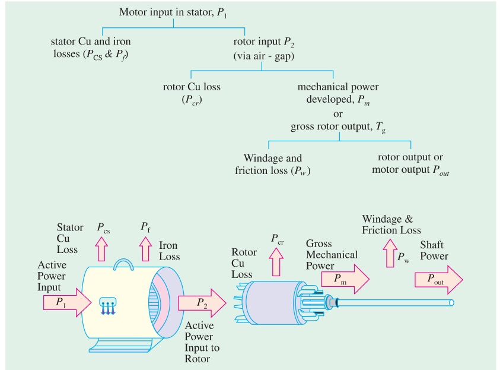

[← T-16: Torque Equations & Curves](T-16_Torque_Equations_and_Characteristics.md) | [🏠 Index](README.md) | [T-18: Testing & Circle Diagram →](T-18_IM_Testing_and_Circle_Diagram.md)

---

# T-17: Power Flow & Rotor Power

**ECE 2207 — Exam-Style Answers (Sorted by Topic)**

> **Topic Overview:** This document compiles all semester final questions and exam-style answers on **Power Flow & Rotor Power** from 7 years of exams (2017–2024).
> Repeated questions appear once with all exam appearances noted.

---

### [2020 Q6(b)]
> 📋 **Appeared in:** 2020 Q6(b)

**(b) Starting from equivalent circuit, derive power equations of an induction motor. [04]**

From the equivalent circuit, per-phase power flow:

**Stator input power:**
$$P_1 = 3V_1 I_1 \cos\phi_1$$

**Stator copper loss:**
$$P_{s,Cu} = 3 I_1^2 R_1$$

**Stator iron loss:**
$$P_{Fe} = 3 V_1^2/R_c \approx 3 E_1^2/R_c$$

**Air-gap power (power transferred to rotor):**
$$P_g = P_1 - P_{s,Cu} - P_{Fe} = 3 I_2^2 \cdot \frac{R_2}{s}$$

**Rotor copper loss:**
$$P_{r,Cu} = 3 I_2^2 R_2 = s \cdot P_g$$

**Gross mechanical power:**
$$P_m = P_g - P_{r,Cu} = P_g(1-s) = 3 I_2^2 R_2 \frac{1-s}{s}$$

**Net output power:**
$$P_{out} = P_m - P_{friction+windage}$$

**Summary ratios:** $P_g : P_{r,Cu} : P_m = 1 : s : (1-s)$

---

### [2020 Q6(d)]
> 📋 **Appeared in:** 2020 Q6(d)

**(d) 400V, 50 Hz, 6-pole, 3-φ IM. Rotor power input = 75 kW. Rotor EMF makes 100 alternations per minute. Find: (i) slip, (ii) rotor speed, (iii) rotor Cu losses per phase, (iv) mechanical power. [04]**

**Given:** $P_g = 75$ kW, $P = 6$, $f = 50$ Hz

Rotor EMF frequency: 100 alternations per minute = 100/60 Hz $= 5/3$ Hz

**(i) Slip:**
$$f_r = sf \implies s = \frac{f_r}{f} = \frac{100/60}{50} = \frac{100}{3000} = \boxed{0.0333 = 3.33\%}$$

**(ii) Synchronous speed:**
$$N_s = \frac{120 \times 50}{6} = 1000 \text{ rpm}$$

**Rotor speed:**
$$N = N_s(1-s) = 1000(1 - 0.0333) = \boxed{966.7 \text{ rpm}}$$

**(iii) Rotor copper losses (total):**
$$P_{r,Cu} = s \times P_g = 0.0333 \times 75000 = 2500 \text{ W}$$

**Per phase:**
$$P_{r,Cu,\text{phase}} = \frac{2500}{3} = \boxed{833.3 \text{ W}}$$

**(iv) Mechanical power:**
$$P_m = (1-s)P_g = (1 - 0.0333) \times 75000 = 0.9667 \times 75000 = \boxed{72500 \text{ W} = 72.5 \text{ kW}}$$

---

### [2021 Q6(c)]
> 📋 **Appeared in:** 2021 Q6(c)

**(c) Determine the rotor efficiency of an IM. [04]**

Rotor efficiency is the ratio of mechanical power developed to the electrical power input to the rotor.

**Power input to rotor (air-gap power):**
$$P_g = 3 I_2^2 \cdot \frac{R_2}{s}$$

**Rotor copper loss:**
$$P_{Cu} = 3 I_2^2 R_2 = s P_g$$

**Mechanical power developed:**
$$P_m = P_g - P_{Cu} = P_g - sP_g = (1-s)P_g$$

**Rotor efficiency:**
$$\eta_{\text{rotor}} = \frac{P_m}{P_g} = \frac{(1-s)P_g}{P_g} = \boxed{(1-s)}$$

Or as percentage: $\eta_{\text{rotor}} = (1-s) \times 100\%$

At full load with $s = 0.04$: $\eta_{\text{rotor}} = 96\%$.

**Interpretation:** For every unit of electrical power crossing the air gap, $(1-s)$ units become mechanical power and $s$ units are lost as heat in the rotor resistance. Low slip → high rotor efficiency. This is why induction motors are designed to operate at small slip.

---

### [2021 Q8(a)]
> 📋 **Appeared in:** 2021 Q8(a)

**(a) Define synchronous watt with an example. [03]**

**Synchronous watt:** A unit of torque used in induction motor calculations. One synchronous watt is the torque that develops one watt of power at synchronous speed.

$$T \text{ (in synchronous watts)} = P_g \text{ (in watts)}$$

**Relationship:**
$$T = \frac{P_g}{\omega_s} = \frac{P_g}{2\pi N_s/60} \text{ N-m}$$

So if $P_g = 1000$ W (1 synchronous watt) and $N_s = 1500$ rpm:
$$T = \frac{1000}{2\pi \times 1500/60} = \frac{1000}{157.08} = 6.37 \text{ N-m}$$

**Example:** A motor has air-gap power $P_g = 5000$ W. If synchronous speed is 1000 rpm ($\omega_s = 104.7$ rad/s):
$$T = \frac{5000}{104.7} = 47.75 \text{ N-m}$$

Expressing the torque as 5000 synchronous watts captures both the power and speed dependence in one quantity.

---

### [2023 Q6(c)]
> 📋 **Appeared in:** 2023 Q6(c)

**(c) What is rotor efficiency? Show that rotor efficiency = $(1-s)$. [03, CO2]**

**Rotor efficiency:** Ratio of mechanical power developed to electrical power input to the rotor (air-gap power).

$$\eta_{\text{rotor}} = \frac{P_m}{P_g} = \frac{(1-s)P_g}{P_g} = \boxed{(1-s)}$$

From the power ratio $P_g : P_{r,Cu} : P_m = 1 : s : (1-s)$:
- Of each unit of air-gap power, fraction $s$ is wasted as rotor copper heat.
- Fraction $(1-s)$ becomes mechanical work.

At $s = 0.04$ (full load, typical): $\eta_{\text{rotor}} = 96\%$. High rotor efficiency is achievable at low slip. Motors are designed to run at small slip for this reason.

---

### [2024 Q5(b)]
> 📋 **Appeared in:** 2018 Q5(b), 2023 Q6(a), 2024 Q5(b) (Years: 2018, 2023, 2024)

**(b) Show that the rotor copper loss = $s \times$ air gap power. Also show $P_m : P_{r,Cu} : P_g = (1-s) : s : 1$. [04, CO2]**

From equivalent circuit, air-gap power:
$$P_g = 3 I_2^2 \cdot \frac{R_2}{s}$$

Rotor copper loss:
$$P_{r,Cu} = 3 I_2^2 R_2 = s \cdot 3 I_2^2 \cdot \frac{R_2}{s} = s \cdot P_g$$

$$\boxed{P_{r,Cu} = s P_g}$$

Mechanical power:
$$P_m = P_g - P_{r,Cu} = P_g - sP_g = (1-s)P_g$$

**Ratio:**
$$P_m : P_{r,Cu} : P_g = (1-s)P_g : sP_g : P_g = \boxed{(1-s) : s : 1}$$

*(Proved)*

---

[← T-16: Torque Equations & Curves](T-16_Torque_Equations_and_Characteristics.md) | [🏠 Index](README.md) | [T-18: Testing & Circle Diagram →](T-18_IM_Testing_and_Circle_Diagram.md)
