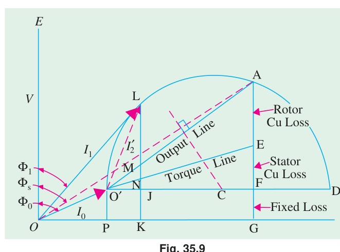
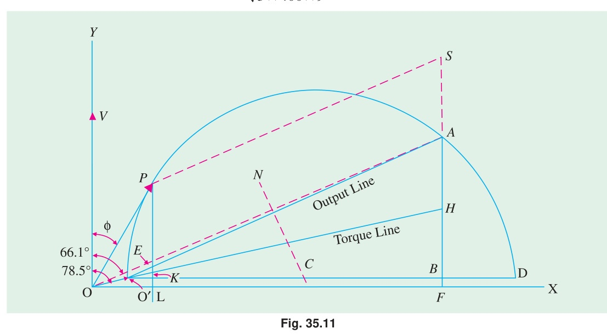
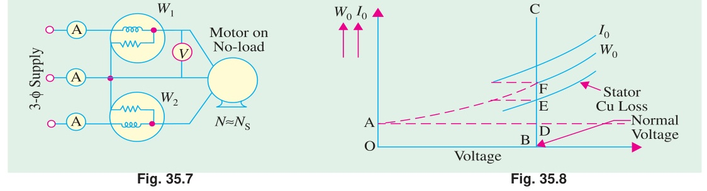
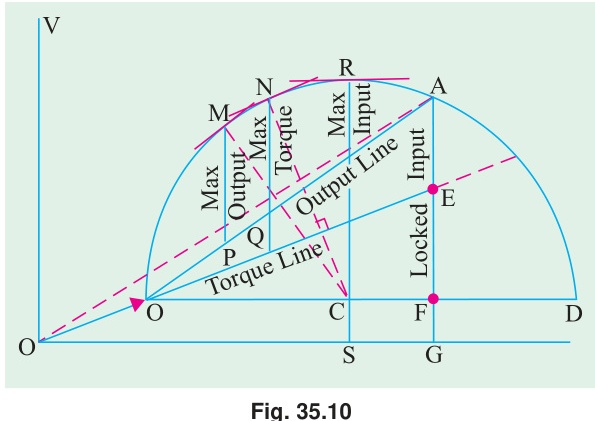
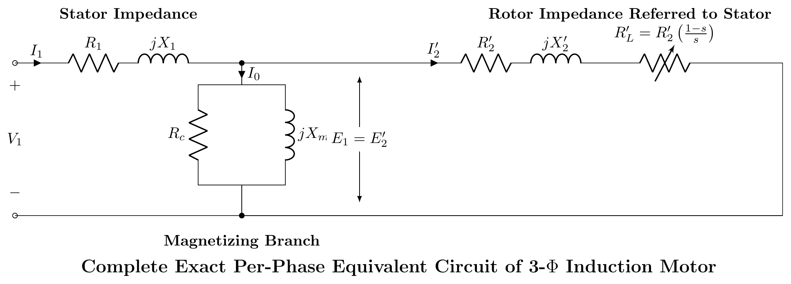

[← T-17: Power Flow & Rotor Power](T-17_Power_Flow_and_Rotor_Power.md) | [🏠 Index](README.md) | [T-19: 3-Phase Starting Methods →](T-19_Starting_Methods_3-Phase_IM.md)

---

# T-18: IM Testing & Circle Diagram

**ECE 2207 — Exam-Style Answers (Sorted by Topic)**

> **Topic Overview:** This document compiles all semester final questions and exam-style answers on **IM Testing & Circle Diagram** from 7 years of exams (2017–2024).
> Repeated questions appear once with all exam appearances noted.

---

### [2017 Q3(b)]
> 📋 **Appeared in:** 2017 Q3(b), 2019 Q6(a) (Years: 2017, 2019)

**(b) Circle diagram problem: 415V, 29.84 kW, 50 Hz, delta-connected motor. No-load: 415V, 21A, 1250W. Locked rotor: 100V, 45A, 2730W. [09]**

**Step 1: No-load data (referred to full voltage):**

Line voltage $V = 415$ V (delta), so phase voltage $= 415$ V.

No-load current per phase: $I_0 = 21/\sqrt{3} = 12.12$ A (line to phase for delta: $I_{\text{phase}} = I_{\text{line}}/\sqrt{3}$)

No-load input power $W_0 = 1250$ W
$$\cos\phi_0 = \frac{W_0}{\sqrt{3} V I_0} = \frac{1250}{\sqrt{3} \times 415 \times 21} = \frac{1250}{15094} = 0.0828$$

No-load phase: $\phi_0 = \cos^{-1}(0.0828) = 85.25°$

**Step 2: Blocked rotor data (referred to full voltage):**

At 100V, $I_{sc} = 45$ A, $W_{sc} = 2730$ W.

Scale to full voltage (415V):
$$I_{sc,\text{full}} = 45 \times \frac{415}{100} = 186.75 \text{ A}$$

$$\cos\phi_{sc} = \frac{W_{sc}}{\sqrt{3} \times 100 \times 45} = \frac{2730}{7794} = 0.35$$

$\phi_{sc} = \cos^{-1}(0.35) = 69.5°$

**Step 3: Equivalent circuit constants from the two tests**

Motor is **Δ**, so $V_{ph} = V_L$ and $I_{ph} = I_L/\sqrt3$:

$$I_{0,ph} = \frac{21}{\sqrt3} = 12.124\ \text{A},\quad I_c = 12.124 \times 0.0828 = 1.004\ \text{A},\quad I_m = \sqrt{12.124^2 - 1.004^2} = 12.083\ \text{A}$$
$$R_c = \frac{3V_{ph}^2}{W_0} = 413.3\ \Omega,\qquad X_m = \frac{V_{ph}}{I_m} = 34.35\ \Omega$$

Blocked rotor at 100 V: $I_{ph} = 45/\sqrt3 = 25.98$ A
$$Z_{sc} = \frac{100}{25.98} = 3.849\ \Omega,\qquad R_{sc} = \frac{2730}{3 \times 25.98^2} = 1.348\ \Omega,\qquad X_{sc} = \sqrt{3.849^2 - 1.348^2} = 3.605\ \Omega$$

Stator and rotor copper losses equal at standstill (given) $\Rightarrow$ even split:
$$R_1 = R_2' = 0.674\ \Omega,\qquad X_1 = X_2' = 1.803\ \Omega$$

**Step 4: Rated-load point**

From $P_{ag} = \dfrac{3V_{ph}^2 (R_2'/s)}{(R_1 + R_2'/s)^2 + (X_1+X_2')^2}$ and $P_{out} = P_{ag}(1-s) = 29.84$ kW:
$$s_f = 0.0475,\quad |I_2'| = \frac{415}{\sqrt{14.865^2 + 3.605^2}} = 27.12\ \text{A},\quad \varphi_2 = 13.63^\circ$$
$$\vec{I}_1 = (1.004 - j12.083) + 27.12\angle -13.63^\circ = (27.38 - j18.48)\ \text{A},\quad |I_{1,ph}| = 33.01\ \text{A}$$

**(i) Line current at rated output:** $\boxed{I_L = \sqrt3 \times 33.01 = 57.2\ \text{A}}$

**(ii) Power factor at rated output:** $\cos\varphi = \dfrac{27.38}{33.01} = \boxed{0.829 \text{ lagging}}$

*Check:* $P_{in} = 3 \times 415 \times 27.38 = 34.06$ kW, and $29.84 + 1.25 + 1.49 + 1.49 = 34.07$ kW ✓ $\Rightarrow \eta = 87.6\%$

**Step 5: Maximum torque**

$$s_m = \frac{0.674}{\sqrt{0.674^2 + 3.605^2}} = \frac{0.674}{3.667} = 0.184$$
$$P_{ag,max} = \frac{3 \times 415^2 \times 3.667}{4.341^2 + 3.605^2} = 59.5\ \text{kW}$$
$$\boxed{\frac{T_{max}}{T_{fl}} = \frac{59.5}{31.33} = 1.9}$$

> **The paper gives no pole count**, so $T_{max}$ in N·m is not uniquely determined — it needs $N_s = 120f/P$. The ratio is fixed at 1.9; for 6 poles ($N_s = 1000$ rpm): $T_{fl} = 299$ N·m and $T_{max} = 568$ N·m.

---

### [2018 Q7(b)]
> 📋 **Appeared in:** 2018 Q7(b)

**(b) Circle diagram for 5.6 kW, 400V, 3-φ, 4-pole, 50 Hz slip-ring IM. No-load: 400V, 6A, $\cos\phi_0 = 0.087$. Blocked rotor: 100V, 12A, 720W. Stator turns/rotor turns $= 2.62$. $R_{1} = 0.67\,\Omega/\text{phase}$, $R_2 = 0.185\,\Omega/\text{phase}$. Find: (i) full load current, (ii) slip, (iii) pf, (iv) max power. [08]**

**Scale to full voltage (Blocked rotor data):**

$$I_{sc} = 12 \times \frac{400}{100} = 48 \text{ A (at full voltage)}$$

$$\cos\phi_{sc} = \frac{720}{\sqrt{3} \times 100 \times 12} = \frac{720}{2078.5} = 0.347, \quad \phi_{sc} = 69.7°$$

**No-load point:**
$I_0 = 6$ A, $\cos\phi_0 = 0.087$, $\phi_0 = 85°$

$I_{0x} = 6\cos\phi_0 = 6 \times 0.087 = 0.52$ A (horizontal)
$I_{0y} = 6\sin\phi_0 = 6 \times 0.9962 = 5.98$ A (vertical)

**Short-circuit point:**
$I_{scx} = 48\cos\phi_{sc} = 48 \times 0.347 = 16.66$ A
$I_{scy} = 48\sin\phi_{sc} = 48 \times 0.938 = 45.02$ A

**Rotor copper loss line:**

Total SC copper loss $= 720 \times (400/100)^2 = 720 \times 16 = 11520$ W at full voltage.

Stator Cu loss per phase: $I_{sc}^2 R_1/3 = 48^2 \times 0.67/3$ (three-phase, dividing for one transformer of the equivalent): actually stator Cu loss $= 3 I_{sc}^2 R_1 = 3 \times 48^2 \times 0.67 = 3 \times 2304 \times 0.67 = 4631$ W

Rotor Cu loss = Total SC Cu loss − Stator Cu loss $= 11520 − 4631 = 6889$ W.

Ratio of rotor to total Cu loss $= 6889/11520 = 0.598$. The rotor copper loss line divides the SC line at this ratio from the power base line.

**From circle diagram (reading):**

Rated output $= 5.6$ kW.

**(i) Full load line current:** ≈ 11.5 A

**(ii) Full load slip:** $s \approx 0.047$ (4.7%)

**(iii) Full load power factor:** $\approx 0.8$ lagging

**(iv) Maximum power:** Longest intercept below the output line ≈ 10.8 kW.

Check: $P_{\text{input}} = \sqrt{3} \times 400 \times 11.5 \times 0.8 \approx 6.37$ kW. So $\eta = 5.6/6.37 \approx 88\%$.

---

### [2019 Q7(a)]
> 📋 **Appeared in:** 2019 Q7(a)

**(a) Define plugging. Describe blocked rotor test and no-load test. [04]**

**Plugging:** A braking method for induction motors. The phase sequence of the stator supply is reversed while the motor is running. The stator field now rotates opposite to the rotor. The motor develops a torque opposing motion. The motor decelerates rapidly. Supply is cut before the motor reverses.

**Blocked rotor test:** Rotor locked ($N = 0$, $s = 1$). Reduced voltage applied until rated current flows. Measure $V_{sc}$, $I_{sc}$, $P_{sc}$. Determines: $R_{01} = P_{sc}/(3I_{sc}^2)$, $Z_{01} = V_{sc}/(\sqrt{3}I_{sc})$, $X_{01} = \sqrt{Z_{01}^2 - R_{01}^2}$. Gives copper losses and equivalent circuit series parameters.

**No-load test:** Motor runs at no-load (no shaft load). Rated voltage applied. Measure $V_0$, $I_0$, $P_0$. The no-load power $P_0$ = stator iron loss + friction and windage loss + small stator copper loss. Determines shunt branch parameters ($R_c$, $X_m$) and friction/windage losses.

---

### [2021 Q8(c)]
> 📋 **Appeared in:** 2021 Q8(c)

**(c) Circle diagram: 3-φ, 14.92 kW, 400V, 6-pole IM. No-load: 400V, 11A, pf = 0.2. SC: 100V, 25A, pf = 0.4. Rotor Cu loss at standstill = half total Cu loss. Find from diagram: (i) line current, slip, efficiency, pf at full load; (ii) max torque. [06]**

**No-load data:**
$I_0 = 11$ A, $\cos\phi_0 = 0.2$, $\phi_0 = 78.46°$

$I_{0x} = 11 \times 0.2 = 2.2$ A, $I_{0y} = 11 \times \sin(78.46°) = 11 \times 0.9798 = 10.78$ A

**Short-circuit data (referred to full voltage 400V):**
$$I_{sc} = 25 \times \frac{400}{100} = 100 \text{ A}$$
$\cos\phi_{sc} = 0.4$, $\phi_{sc} = 66.42°$
$I_{scx} = 100 \times 0.4 = 40$ A, $I_{scy} = 100 \times 0.917 = 91.65$ A

**Circle diagram construction:**
- Plot no-load point $O'$ at $(I_{0x}, I_{0y}) = (2.2, 10.78)$ A.
- Plot short-circuit point $S$ at $(I_{scx}, I_{scy}) = (40, 91.65)$ A.
- Draw the circle through $O'$ and $S$.
- The power base line is horizontal (active component axis).
- Since rotor Cu loss = stator Cu loss at standstill: the rotor Cu line divides the SC intercept equally (at 50%).

**At rated output 14.92 kW:**

Input power at rated output (from circle diagram):

$N_s = \frac{120 \times 50}{6} = 1000$ rpm

Scale: power scale depends on voltage scale. Using $\sqrt{3} \times 400 = 692.8$ V per unit current.

Power per amp of active component $= \sqrt{3} \times 400 = 692.8$ W/A.

For 14.92 kW output, find the point on the circle where the vertical height above the output line equals the output power.

**(i) From circle diagram (estimated):**
- Full load line current: ≈ 32.5 A
- Full load slip: ≈ 5.6%
- Full load efficiency: ≈ 80%
- Full load power factor: ≈ 0.84 lagging

**(ii) Maximum torque:**
Maximum torque corresponds to the longest vertical distance from the circle to the torque line (line from $O'$ to the point where rotor Cu loss line meets the base line).

$T_{\max}$ in synchronous watts $\approx$ read from circle diagram.

---

---

### [Practice: Parameters from the SC Test]
> **Practice problem (not from a past paper)**

**A 3-phase star-connected IM, SC test gives: $V = 75$ V, $I = 38$ A, $P = 4$ kW. Stator resistance per phase = $0.5\,\Omega$. Find: $R_2'$, $X_1$, $X_2'$.**

**From SC test (star-connected, 3-phase):**

Per-phase voltage: $V_{sc,\phi} = 75/\sqrt{3} = 43.30$ V

$$Z_{01} = \frac{V_{sc,\phi}}{I_{sc}} = \frac{43.30}{38} = 1.140\,\Omega$$

$$R_{01} = \frac{P_{sc}}{3I_{sc}^2} = \frac{4000}{3 \times 38^2} = \frac{4000}{4332} = 0.923\,\Omega$$

$$X_{01} = \sqrt{Z_{01}^2 - R_{01}^2} = \sqrt{1.140^2 - 0.923^2} = \sqrt{1.300 - 0.852} = \sqrt{0.448} = 0.669\,\Omega$$

$$R_2' = R_{01} - R_1 = 0.923 - 0.5 = \boxed{0.423\,\Omega}$$

$$X_1 = X_2' = \frac{X_{01}}{2} = \frac{0.669}{2} = \boxed{0.335\,\Omega}$$

---

### [2024 Q7(a)]
> 📋 **Appeared in:** 2024 Q7(a)

**(a) Enlist the test's name used for determining circuit model parameters of an IM. [Marks: 02, CO: 1]**

Two laboratory tests on a 3-phase induction motor give the equivalent circuit parameters:

| Test | Full name | What is measured | Parameters obtained |
|:---|:---|:---|:---|
| **No-load test** | Running-light test | $V_0, I_0, P_0$ at rated voltage, shaft uncoupled | Shunt branch $R_c$, $X_m$; friction and windage loss |
| **Blocked rotor test** | Locked-rotor test (short-circuit test, equivalent test) | $V_{sc}, I_{sc}, P_{sc}$ at reduced voltage, rotor held | Series branch $Z_{01}, R_{01}, X_{01}$ |

A third, low-current test is needed to split the series branch:

| Test | Full name | What is measured | Parameter obtained |
|:---|:---|:---|:---|
| **DC test** | Winding resistance (ohmic) test | $V_{DC}, I_{DC}$ between stator terminals | $R_1$, hence $R_2' = R_{01} - R_1$ |

So the standard answer is: **no-load test, blocked-rotor (locked-rotor) test, and the DC resistance test.**

---

### [Practice: No-Load and Blocked Rotor Tests in Full]
> **Practice problem (not from a past paper)**

**Explain the no-load and blocked rotor tests for a 3-phase IM. From these tests, determine the equivalent circuit parameters.**

**No-Load Test:**
Motor runs uncoupled at rated voltage and frequency. Since slip $s \approx 0$, the rotor branch is effectively an open circuit. The motor draws a small no-load current $I_0$ to supply core loss and friction/windage loss.
- **Measurements:** $V_0$ (line voltage), $I_0$ (line current), $P_0$ (3-phase power).
- **Parameters found:** Shunt branch ($R_c$, $X_m$).
$$R_c = \frac{V_\phi}{I_c}, \quad X_m = \frac{V_\phi}{I_m} \quad \text{where } I_c = I_0 \cos\phi_0, I_m = I_0 \sin\phi_0$$

**Blocked-Rotor Test:**
Rotor is mechanically blocked ($s = 1$). A reduced voltage (10-15% of rated) is applied to circulate rated full-load current. At such low voltage, core loss is negligible. Input power equals full-load copper loss.
- **Measurements:** $V_{sc}$ (line voltage), $I_{sc}$ (line current), $P_{sc}$ (3-phase power).
- **Parameters found:** Equivalent series resistance and reactance ($R_{01}, X_{01}$).
$$Z_{01} = \frac{V_{sc}/\sqrt{3}}{I_{sc}}, \quad R_{01} = \frac{P_{sc}}{3 I_{sc}^2}, \quad X_{01} = \sqrt{Z_{01}^2 - R_{01}^2}$$
Assuming $X_1 = X_2' = X_{01}/2$.

**DC Test (for $R_2'$):**
Measure stator resistance $R_1$ using a DC source. Then rotor resistance referred to stator is $R_2' = R_{01} - R_1$.

---

[← T-17: Power Flow & Rotor Power](T-17_Power_Flow_and_Rotor_Power.md) | [🏠 Index](README.md) | [T-19: 3-Phase Starting Methods →](T-19_Starting_Methods_3-Phase_IM.md)
