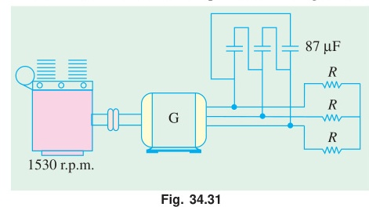

[← T-20: Speed Control & Braking](T-20_Speed_Control_and_Braking.md) | [🏠 Index](README.md) | [T-22: 1-Phase IM Theory (DFRT) →](T-22_Single-Phase_IM_Theory_DFRT.md)

---

# T-21: Induction Generator

**ECE 2207 — Exam-Style Answers (Sorted by Topic)**

> **Topic Overview:** This document compiles all semester final questions and exam-style answers on **Induction Generator** from 7 years of exams (2017–2024).
> Repeated questions appear once with all exam appearances noted.

---

### [2018 Q5(c)]
> 📋 **Appeared in:** 2018 Q5(c)

**(c) 440V, 4-pole, 1470 rpm, 30 kW, 3-phase IM used as asynchronous generator. Rated current 40A, pf = 85%. Find: (i) capacitance per phase (Δ-connected), (ii) engine speed for 50 Hz. [04]**

**Given:** $V_L = 440$ V, $P = 4$, $N_{\text{rated}} = 1470$ rpm, $I_L = 40$ A, $\cos\phi = 0.85$

**Synchronous speed (50 Hz, 4-pole):**
$$N_s = \frac{120 \times 50}{4} = 1500 \text{ rpm}$$

**(i) Capacitance per phase (Δ-connected):**

The reactive power drawn by the motor at rated conditions (which must be supplied by capacitors when used as induction generator):

$$Q = \sqrt{3} V_L I_L \sin\phi$$

$\sin\phi = \sqrt{1 - 0.85^2} = \sqrt{1 - 0.7225} = \sqrt{0.2775} = 0.5268$

$$Q = \sqrt{3} \times 440 \times 40 \times 0.5268 = 1.732 \times 440 \times 40 \times 0.5268 = 16065 \text{ VAR} \approx 16.07 \text{ kVAR}$$

For Δ-connected capacitors, reactive power per phase:
$$Q_{\text{phase}} = \frac{Q}{3} = \frac{16065}{3} = 5355 \text{ VAR}$$

Phase voltage for Δ-connected: $V_\text{phase} = V_L = 440$ V

$$Q_\text{phase} = \frac{V_\text{phase}^2}{X_C} \implies X_C = \frac{V^2}{Q_\text{phase}} = \frac{440^2}{5355} = \frac{193600}{5355} = 36.15\,\Omega$$

$$C = \frac{1}{2\pi f X_C} = \frac{1}{2\pi \times 50 \times 36.15} = \frac{1}{11357} = \boxed{88.1\text{--}88.2\,\mu\text{F per phase}}$$

**(ii) Engine speed for 50 Hz generation:**

The motor full-load slip: $s = \frac{N_s - N}{N_s} = \frac{1500 - 1470}{1500} = 0.02$

As an induction generator, rotor runs faster than synchronous speed. Slip is negative with same magnitude:
$$s_{\text{gen}} = -0.02$$

$$N_{\text{rotor}} = N_s(1 - s_{\text{gen}}) = 1500(1 - (-0.02)) = 1500 \times 1.02 = \boxed{1530 \text{ rpm}}$$

The engine must drive the rotor at 1530 rpm to generate at 50 Hz.

---

---

### [2023 Q8(b)]
> 📋 **Appeared in:** 2023 Q8(b)

**(b) With the help of schematic arrangements, describe how IM can be operated as IG? [CO3, Marks: 03]**

**Principle.** Drive the rotor **above** synchronous speed with a prime mover. Then $N > N_s$, so
$$s = \frac{N_s - N}{N_s} < 0$$

With negative slip the rotor emf, rotor current and torque all reverse. The machine now opposes the prime mover, absorbs mechanical power at the shaft and feeds electrical power out through the stator. It has become an **induction generator**.

#### Arrangement 1: Grid-connected induction generator

The stator stays connected to a live 3-phase line. The line fixes the voltage and the frequency, and supplies the magnetising (reactive) power.

- **Active power $P$** flows out of the stator into the line.
- **Reactive power $Q$** flows from the line into the machine, because the generator needs it to set up its own field.

So the machine delivers $P$ and absorbs $Q$ at the same time, and the two flow in opposite directions.

#### Arrangement 2: Self-excited induction generator

For an isolated load there is no line to draw $Q$ from. Connect a **capacitor bank** across the stator terminals instead. The capacitors supply the reactive power:
$$Q_C = \text{capacitor output} \ \geq \ Q \ \text{required by machine and load}$$

Residual magnetism in the rotor starts the build-up. Voltage grows until the capacitor line crosses the machine magnetising curve.

**Characteristics.**

| Feature | Grid-connected | Self-excited |
|:---|:---|:---|
| Source of $Q$ | The line | Capacitor bank |
| Voltage and frequency set by | The line | Speed and capacitance |
| Voltage regulation | Good | Poor |

**Merits.** No d.c. field winding, no brushes, no synchronising needed, rugged and cheap, and it cannot be overloaded because torque falls off beyond the breakdown point.

**Limits.** Cannot supply reactive power. Cannot work alone without capacitors. Voltage and frequency are not independently controllable. Used for small hydro and wind plants.

---

### [2024 Q8(b)]
> 📋 **Appeared in:** 2024 Q8(b)

**(b) Describe the process following which an IM can be operated as IG. [Marks: 04, CO: 2]**

**Step 1 — Reverse the sign of slip.** An induction motor becomes a generator only when the rotor turns **faster** than the rotating field. That is $N > N_s$, so
$$s = \frac{N_s - N}{N_s} < 0$$
The whole operating picture is set by this one sign change.

**Step 2 — What happens at negative slip.** The rotor emf $E_{2r} = sE_2$, the rotor current and the rotor copper loss all reverse sign. Rotor current now opposes the stator field as seen by the rotor, so the rotor reaction is no longer opposing but assisting. The electromagnetic torque becomes a **braking** torque.

**Step 3 — Reverse the power flow.** Instead of taking power from the line through the shaft and giving it back through the rotor, the machine does the opposite:

| Port | Power direction in motoring | Power direction in generating |
|:---|:---|:---|
| Shaft | power **out** of the machine | power **in** to the machine |
| Stator terminals | power **in** from the line | power **out** to the line |

**Step 4 — Set up the excitation.** The machine still needs reactive power to magnetise itself. On a live grid the line supplies it. On an isolated load, connect a **capacitor bank** across the stator terminals so the capacitors provide the magnetising VARs; residual magnetism in the rotor starts the voltage build-up.

**Step 5 — Pick the speed and load.** The prime mover (engine, turbine) must run at a little above $N_s = 120f/P$. With the grid holding $f$, the speed is essentially fixed and the prime mover power sets the load. Beyond the breakdown point further prime-mover torque gives less output, so the machine cannot be overloaded.

**Grids where it is used:** wind turbines and small hydro (self-excited, with capacitors), and regenerative braking on cranes, hoists and electric trains where the line simply absorbs the regenerated energy.

---

### [2024 Q8(c)]
> 📋 **Appeared in:** 2018 Q5(c), 2024 Q8(c) (Years: 2018, 2024)

**(c) A 440V, 4-pole, 1470 rpm, 30-kW, 3-$\varphi$ IM is to be used as IG, the rated current of the motor is 40A and full-load power factor is 85%. Now, calculate — [Marks: 04, CO: 2]**
> **(i)** Capacitance required per phase if capacitors are connected in delta.
> **(ii)** Speed of the driving engine for generating a frequency of 50 Hz.

> [!NOTE] This is a verbatim repeat of 2018 Q5(c). The numbers are identical, so learn one solution.

**Synchronous speed (50 Hz, 4-pole):**
$$N_s = \frac{120 \times 50}{4} = 1500\text{ rpm}$$

#### (i) Capacitance per phase, delta connected

The machine must be given the reactive power it used to draw as a motor.

$$\sin\phi = \sqrt{1 - 0.85^2} = \sqrt{0.2775} = 0.5268$$
$$Q = \sqrt{3} \times V_L \times I_L \times \sin\phi = 1.732 \times 440 \times 40 \times 0.5268 = 16065\text{ VAR} \approx 16.07\text{ kVAR}$$

Reactive power per phase:
$$Q_{ph} = \frac{16065}{3} = 5355\text{ VAR}$$

In delta, $V_{ph} = V_L = 440$ V, so
$$C = \frac{Q_{ph}}{2\pi f V_{ph}^2} = \frac{5355}{2\pi \times 50 \times 440^2} = \frac{5355}{6.0822 \times 10^7} = 8.805 \times 10^{-5}\text{ F}$$

$$\boxed{C = 88.2\ \mu\text{F per phase, connected in delta}}$$

#### (ii) Speed of the driving engine for 50 Hz generation

Running at 1470 rpm the machine is **below** the 1500 rpm synchronous speed, so as given it is still motoring. To generate it must be driven above 1500 rpm.

Magnitude of slip at the rated operating point:
$$|s| = \frac{1500 - 1470}{1500} = 0.02$$

For the machine to be a generator, $s_{gen} = -0.02$, and $N = N_s(1 - s_{gen})$:
$$N = 1500 \times (1 + 0.02) = 1500 \times 1.02$$

$$\boxed{N_{\text{engine}} = 1530\text{ rpm}}$$

---

[← T-20: Speed Control & Braking](T-20_Speed_Control_and_Braking.md) | [🏠 Index](README.md) | [T-22: 1-Phase IM Theory (DFRT) →](T-22_Single-Phase_IM_Theory_DFRT.md)
