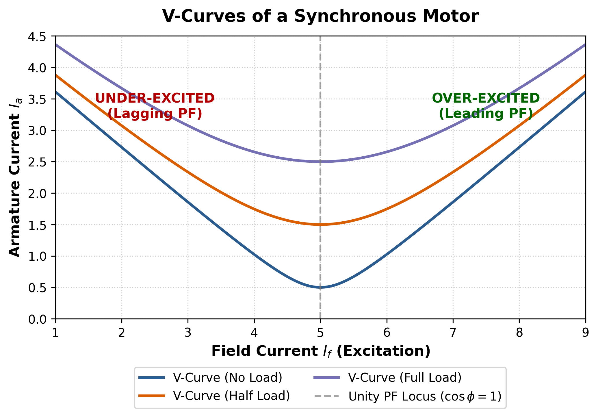

[← T-24: Single Phasing](T-24_Single_Phasing.md) | [🏠 Index](README.md) | *(end)*

---

# T-25: Miscellaneous IM Topics

**ECE 2207 — Exam-Style Answers (Sorted by Topic)**

> **Topic Overview:** This document compiles all semester final questions and exam-style answers on **Miscellaneous IM Topics** from 7 years of exams (2017–2024).
> Repeated questions appear once with all exam appearances noted.

---

### [2020 Q5(a)]
> 📋 **Appeared in:** 2020 Q5(a)

**(a) Classify AC motors. [02]**

---

### [2020 Q6(a)]
> 📋 **Appeared in:** 2020 Q6(a)

**(a) How can the direction of rotation of a 3-phase IM be reversed? [02]**

Interchange any two of the three supply phase connections to the stator terminals. For example, swap phase A and phase B connections.

This reverses the phase sequence (A-B-C → B-A-C), which reverses the direction of the rotating magnetic field. Since the rotor follows the RMF, the rotor also reverses direction.

---

### [2020 Q6(c)]
> 📋 **Appeared in:** 2020 Q6(c)

**(c) Why is a synchronous motor not self-starting? [02]**

A synchronous motor requires the rotor to rotate in synchronism with the stator RMF. At starting:

1. The stator RMF immediately rotates at synchronous speed $N_s = 120f/P$ rpm.
2. The rotor (with field winding energized) is at rest.
3. The stator field grabs the rotor poles and tries to pull them around.
4. But the rotor has inertia. Before it can respond, the stator field has already rotated 180° and is now pulling in the opposite direction.
5. Net average torque over one cycle = 0.

So a synchronous motor cannot self-start. A damper winding (squirrel-cage bars on the rotor pole faces) is used to start it as an induction motor. Then the field winding is energized to pull it into synchronism.

---

### [2020 Q8(d)]
> 📋 **Appeared in:** 2020 Q8(d)

**(d) How is the V-curve for a synchronous motor obtained? [03]**

A V-curve shows the relationship between armature current $I_a$ and field current $I_f$ at constant load (constant mechanical output).

**Procedure:**
1. Run the synchronous motor at constant mechanical load.
2. Vary the field current $I_f$ from underexcited (low $I_f$) to overexcited (high $I_f$).
3. Record armature current $I_a$ at each field current setting.

**Shape of curve:**
- At unity power factor (certain value of $I_f$): $I_a$ is minimum. This is the bottom of the V.
- Below unity pf (underexcited): $I_a$ increases and lags voltage (lagging pf).
- Above unity pf (overexcited): $I_a$ increases and leads voltage (leading pf, acts as capacitor bank).

---

---

### [2021 Q4(b)]
> 📋 **Appeared in:** 2021 Q4(b)

**(b) What methods can be used for generating magnetic field? [04]**

Magnetic fields can be generated by several methods:

1. **Permanent magnets:** Iron, alnico, neodymium magnets produce static fields. Used in BLDC motors, PMSMs, speakers.

2. **DC electromagnets:** DC current through a coil wound on an iron core creates a constant magnetic field. Used in synchronous motors, DC machines, relays.

3. **AC electromagnets:** Alternating current through a coil creates a pulsating magnetic field. Used in transformer cores, AC contactors.

4. **Rotating magnetic field (3-phase windings):** Three-phase AC currents in three spatially displaced windings create a continuously rotating field of constant magnitude. Used in 3-phase induction and synchronous motors.

5. **Rotating magnetic field (2-phase):** Two-phase currents (90° apart) in windings 90° apart in space produce a rotating field. Less common, used in some servo systems.

6. **Single-phase with auxiliary winding:** Capacitor or resistance creates phase split, giving a rotating field. Used in single-phase induction motors.

---

### [2023 Q6(b)]
> 📋 **Appeared in:** 2023 Q6(b)

**(b) How can we improve the poor power factor of an induction motor at light loads? [03, CO2]**

At light load, the motor draws mostly magnetizing current (reactive). The working (active) component is small. So the power factor is very low.

**Methods to improve power factor:**

1. **Avoid running at no-load or very light load:** Switch off motors that are idling.
2. **Capacitor banks:** Connect shunt capacitors at the motor terminals. Reactive current from capacitors offsets the lagging reactive current of the motor.
3. **Use appropriately sized motor:** An oversized motor at light load has low pf. Match motor size to load requirement.
4. **Synchronous condenser:** A synchronous motor running at no-load (overexcited) supplies reactive power to the system.
5. **Variable frequency drive (VFD):** Reduces voltage at light load, which reduces flux and reduces magnetizing current. Improves efficiency and pf at light loads.

---

[← T-24: Single Phasing](T-24_Single_Phasing.md) | [🏠 Index](README.md) | *(end)*
