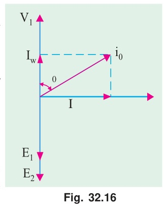
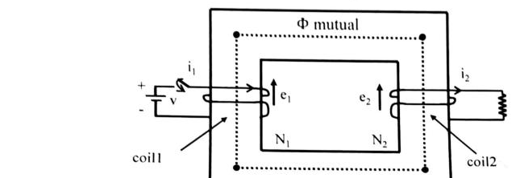

[← T-02: Construction & Core](T-02_Transformer_Construction_and_Core.md) | [🏠 Index](README.md) | [T-04: Equivalent Circuit →](T-04_Equivalent_Circuit.md)

---

# T-03: No-Load Operation & Phasor Diagrams

**ECE 2207 — Explanation Answers (Sorted by Topic)**

> **Topic Overview:** This document compiles all semester final questions and explanation answers on **No-Load Operation & Phasor Diagrams** from 7 years of exams (2017–2024).
> Repeated questions appear once with all exam appearances noted.

---

### Q1(c): Why does primary current increase with secondary load?

> 📋 **Appeared in:** 2019 Q1(c)

#### The fundamental principle: MMF balance

An ideal transformer maintains the core flux $\Phi_m$ at a constant value (set by the supply voltage: $\Phi_m \approx V_1/(4.44 f N_1)$). This flux requires a certain amount of magnetomotive force (MMF):

$$\text{MMF required} = H \times l_c = \Phi_m \times \frac{l_c}{\mu A}$$

At no-load, the primary provides all the required MMF: $N_1 I_0 = $ const.

When a load draws secondary current $I_2$: The secondary current through $N_2$ turns creates a demagnetizing MMF = $N_2 I_2$. This tends to reduce the core flux.

But $V_1$ is fixed by the supply. Since $V_1 \approx E_1 = 4.44 f N_1 \Phi_m$, the flux cannot change (it's tied to the supply voltage). The primary current must increase to cancel the secondary demagnetization:

$$N_1 I_1 - N_2 I_2 = N_1 I_0 \approx \text{const}$$

$$N_1 I_1 = N_1 I_0 + N_2 I_2$$

$$I_1 = I_0 + \frac{N_2}{N_1} I_2 = I_0 + I_2'$$

As $I_2$ increases (more load), $I_1$ increases proportionally (larger primary current from the supply).

**Energy flow:** The increased primary current brings in more energy from the supply to match the energy delivered to the load. The transformer doesn't generate energy: it regulates primary current to always match the secondary load.

---

---

---

### [2024 Q1(b)]: Induced Voltage Phenomena upon Transformer Excitation

> 📋 **Appeared in:** 2024 Q1(b)

**(b) When a power transformer is excited as a manner shown in following figure, then describe the induced voltage phenomena — [Marks: 04, CO: 2]**

#### Comprehensive Physical Analysis of Induced Voltage Phenomena

The provided schematic illustrates a two-limb closed rectangular ferromagnetic core. Coil 1 ($N_1$ turns) is wound on the left limb and connected to a DC source $v$ through a series control switch. Coil 2 ($N_2$ turns) is wound on the right limb and connected across a passive resistive load $R$. Both coils share the common closed magnetic circuit carrying mutual flux $\Phi_{\text{mutual}}$.

Because the excitation source is DC, this circuit demonstrates **transient electromagnetic induction** during circuit switching:

1. **Switch Closure and Current Build-Up ($t = 0^+$):**
   - At the instant the switch is closed, an electric current $i_1(t)$ begins to circulate into the upper terminal of Coil 1.
   - The primary current produces an excitation magnetomotive force ($\mathcal{F}_1 = N_1 i_1$) around the core.

2. **Establishment of Time-Varying Mutual Flux ($\Phi_{\text{mutual}}$):**
   - The MMF drives magnetic flux through the closed ferromagnetic path. The core flux rises from its initial residual value according to the core reluctance $\mathcal{R}$:
     $$\Phi_{\text{mutual}}(t) = \frac{N_1 i_1(t)}{\mathcal{R}}$$
   - As long as the current is growing, a positive time rate of change of flux exists: $\frac{d\Phi_{\text{mutual}}}{dt} > 0$.

3. **Self-Induction in Primary (Coil 1 — Counter-EMF $e_1$):**
   - In accordance with **Faraday's Law of Electromagnetic Induction**, the changing flux threading through the $N_1$ turns of Coil 1 induces a self-induced electromotive force:
     $$e_1(t) = -N_1 \frac{d\Phi_{\text{mutual}}}{dt}$$
   - By **Lenz's Law**, the polarity of $e_1$ acts in opposition to the applied voltage $v$ (counter-EMF), limiting the rate of rise of $i_1(t)$ according to the loop equation:
     $$v(t) - e_1(t) = i_1(t) R_1 \implies v = i_1 R_1 + N_1 \frac{d\Phi_{\text{mutual}}}{dt}$$

4. **Mutual Induction in Secondary (Coil 2 — Induced Voltage $e_2$):**
   - Since both coils are linked by the shared ferromagnetic core, the identical mutual flux $\Phi_{\text{mutual}}(t)$ threads through all $N_2$ turns of Coil 2 on the right limb.
   - A mutually induced electromotive force $e_2(t)$ is established across Coil 2:
     $$e_2(t) = -N_2 \frac{d\Phi_{\text{mutual}}}{dt}$$
   - The ratio of instantaneous induced voltages equals the turns ratio:
     $$\frac{e_1(t)}{e_2(t)} = \frac{N_1}{N_2}$$

5. **Load Current and Secondary Reaction Flux (Lenz's Law):**
   - The induced EMF $e_2(t)$ drives secondary load current $i_2(t) = e_2(t)/R$ out from the upper terminal into the resistive load.
   - This secondary current establishes a secondary demagnetizing MMF ($\mathcal{F}_2 = N_2 i_2$) which produces a reaction flux $\Phi_2$ directed in opposition to the primary-established flux build-up $\frac{d\Phi}{dt}$. This represents the fundamental principle of transformer action and energy transfer across magnetic coupling.

6. **Steady-State DC Saturation ($t \to \infty$):**
   - Eventually, the primary current reaches its constant Ohm's law limit: $I_1 = V / R_1$.
   - Once current is constant, $\frac{d\Phi_{\text{mutual}}}{dt} = 0$.
   - Consequently, **both induced voltages drop to zero** ($e_1 = 0$, $e_2 = 0$) and secondary current ceases ($i_2 = 0$). This proves why steady-state DC cannot maintain continuous transformer action.

---

### [2024 Q2(a)]: Non-Sinusoidal Nature of Transformer Magnetizing Current

> 📋 **Appeared in:** 2024 Q2(a)

**(a) "The magnetizing current of power transformer is not fully sinusoidal" — justify it. [Marks: 02, CO: 1]**

#### Physical Justification

When a power transformer is connected to a pure sinusoidal AC supply voltage $v_1(t) = V_m \sin(\omega t)$:

1. **Constraint of Sinusoidal Core Flux:**
   - Under no-load conditions, the winding resistance drop is negligible ($I_0 R_1 \approx 0$), meaning the induced back-EMF must balance the sinusoidal supply voltage: $e_1(t) \approx -v_1(t)$.
   - Since $e_1 = -N_1 \frac{d\Phi}{dt}$, the core flux $\Phi(t)$ must strictly be a sinusoidal waveform lagging the voltage by $90^\circ$:
     $$\Phi(t) = \Phi_m \sin(\omega t - 90^\circ) = -\Phi_m \cos(\omega t)$$

2. **Non-Linear B-H Characteristic of Ferromagnetic Core:**
   - The relationship between core flux density ($B = \Phi/A$) and magnetic field intensity ($H = N_1 i_m / l_c$) is dictated by the ferromagnetic core's **non-linear $B\text{-}H$ magnetization curve** and saturation characteristics.
   - In modern power transformers, economic design requires operating the core near the "knee" of the saturation curve ($B_m \approx 1.5\text{–}1.7\text{ T}$).

3. **Distortion of Magnetizing Current ($i_m$):**
   - In the linear region (low flux values), $i_m$ is proportional to flux.
   - As the sinusoidal flux approaches its peak $\Phi_m$, the iron enters magnetic saturation, where core permeability ($\mu = B/H$) drops sharply.
   - To force the flux along its prescribed sinusoidal peak, the core demands an enormous, disproportionate spike in magnetizing MMF ($N_1 i_m$).
   - As a result, the required magnetizing current waveform $i_m(t)$ is **sharply peaked** (non-sinusoidal), despite the core flux being purely sinusoidal.

4. **Harmonic Content (Fourier Analysis):**
   - Because the $B\text{-}H$ curve is symmetrical in positive and negative half-cycles, no even harmonics exist.
   - Fourier decomposition reveals that the peaked magnetizing current contains a strong **third harmonic component** (typically $30\%\text{–}40\%$ of the fundamental), along with smaller 5th and 7th harmonics.
   - **Conclusion:** Due to ferromagnetic saturation and non-linear permeability of the steel core, the magnetizing current is inherently non-sinusoidal.

---

### [2018 Q1(c) / 2024 Q2(b)]: Complete Vector Diagram and Equivalent Circuit on Load (R-L Load)

> 📋 **Appeared in:** 2018 Q1(c), 2024 Q2(b) (Years: 2018, 2024)

**(b) Draw and explain the phasor diagram of a power transformer, when the transformer is loaded with "R-L" load. [Marks: 04, CO: 1]**

#### 1. Exact Equivalent Circuit of a Practical Transformer
A practical two-winding transformer deviates from the ideal model due to finite copper conductivity ($R_1, R_2$), leakage fluxes ($\Phi_{l1}, \Phi_{l2} \to X_1, X_2$), and finite core permeability with iron losses ($R_c \parallel jX_m$). The complete exact equivalent circuit is:

* **Primary winding series impedance**: $\mathbf{Z}_1 = R_1 + jX_1$ accounts for primary winding resistance drop and leakage reactance drop.
* **Core excitation shunt branch**: Connected across primary induced back-EMF $\mathbf{E}_1$. Resistor $R_c$ carries active core-loss current $I_c$ (hysteresis + eddy current), while reactor $X_m$ carries reactive magnetizing current $I_m$ that sets up the mutual alternating flux $\Phi_m$.
* **Ideal transformer**: Scaled by turns ratio $a = N_1 / N_2$ providing galvanic isolation:
  $$\frac{E_1}{E_2} = \frac{N_1}{N_2} = a, \qquad \frac{I_2'}{I_2} = \frac{N_2}{N_1} = \frac{1}{a}$$
* **Secondary winding series impedance**: $\mathbf{Z}_2 = R_2 + jX_2$ accounts for secondary internal voltage drops before supplying terminal voltage $\mathbf{V}_2$ to load $Z_L$.

---

#### 2. Complete Vector (Phasor) Diagram on Load (Lagging Power Factor, $\cos\phi_2$)
For an inductive load with lagging power factor $\cos\phi_2$, the secondary current $\vec{I}_2$ lags the secondary terminal voltage $\vec{V}_2$ by phase angle $\phi_2$.

##### Step-by-Step Construction Logic:
1. **Reference Mutual Flux ($\vec{\Phi}$)**:
   - Drawn horizontally along $+X$. Mutual flux is the common coupling medium linking both primary and secondary windings.
2. **Induced EMFs ($\vec{E}_1, \vec{E}_2$)**:
   - By Faraday's Law, induced EMF lags mutual flux by $90^\circ$:
     $$e = -N \frac{d\Phi}{dt} \implies \vec{E} \text{ lags } \vec{\Phi} \text{ by } 90^\circ$$
   - Both $\vec{E}_1$ and $\vec{E}_2$ are drawn vertically downward along $-Y$.
3. **Secondary Load Triangle**:
   - Secondary terminal voltage $\vec{V}_2$ leads secondary current $\vec{I}_2$ by load angle $\phi_2$ (i.e., $\vec{I}_2$ lags $\vec{V}_2$).
   - Applying secondary KVL:
     $$\vec{E}_2 = \vec{V}_2 + \vec{I}_2 R_2 + j\vec{I}_2 X_2$$
   - From the terminal of $\vec{V}_2$, draw resistive drop $\vec{I}_2 R_2$ **parallel** to $\vec{I}_2$.
   - From that tip, draw inductive leakage reactance drop $j\vec{I}_2 X_2$ **perpendicular (leading by $90^\circ$)** to $\vec{I}_2$.
   - The vector sum reaches the tip of induced EMF $\vec{E}_2$.
4. **Primary Counter-EMF ($-\vec{E}_1$)**:
   - To counteract the induced EMF, the primary applied voltage must establish $-\vec{E}_1$.
   - Draw $-\vec{E}_1$ vertically upward along $+Y$ ($180^\circ$ opposite to $\vec{E}_1$, leading $\vec{\Phi}$ by $90^\circ$).
5. **Primary Current Components**:
   - **Load reflected current ($\vec{I}_2'$)**: To neutralize secondary demagnetizing MMF ($N_2 \vec{I}_2$), primary draws load component $\vec{I}_2' = (N_2/N_1) \vec{I}_2$ oriented **$180^\circ$ opposite** to $\vec{I}_2$.
   - **Excitation current ($\vec{I}_0$)**: Composed of active loss component $\vec{I}_c$ (parallel to $-\vec{E}_1$) and reactive magnetizing component $\vec{I}_m$ (parallel to $\vec{\Phi}$):
     $$\vec{I}_0 = \vec{I}_c + \vec{I}_m, \qquad I_0 = \sqrt{I_c^2 + I_m^2}$$
   - **Total primary current ($\vec{I}_1$)**: Vector sum of no-load current and reflected load current:
     $$\vec{I}_1 = \vec{I}_0 + \vec{I}_2'$$
6. **Primary Terminal Voltage ($\vec{V}_1$)**:
   - Applying primary KVL:
     $$\vec{V}_1 = -\vec{E}_1 + \vec{I}_1 R_1 + j\vec{I}_1 X_1$$
   - From the tip of $-\vec{E}_1$, add primary resistance drop $\vec{I}_1 R_1$ **parallel** to $\vec{I}_1$.
   - From that point, add primary leakage reactance drop $j\vec{I}_1 X_1$ **perpendicular (leading by $90^\circ$)** to $\vec{I}_1$.
   - The line joining the origin to the endpoint of $j\vec{I}_1 X_1$ represents the applied primary voltage $\vec{V}_1$.
   - The angle between $\vec{V}_1$ and $\vec{I}_1$ is the primary operating phase angle $\phi_1$, giving input power factor $\cos\phi_1$ (lagging).

> **Sources:** [Books/Ch-32_02_Phasor_and_Equivalent_Circuit.md](../Books/Theraja/Ch-32/Ch-32_02_Equivalent_Circuit_and_Drop.md) · [ClassNoteByRaidah/Class_14.md](../ClassNoteByRaidah/Class_14_Equivalent_Circuit_and_Parameter_Shifting.md) · [SlidesByMaam/L-02_ECE-2207.md](../SlidesByMaam/L-02_ECE-2207.md)

---

### [2024 Q1(c)]: Worked Numerical Problem — Magnetizing and Working Components of No-Load Current

> 📋 **Appeared in:** 2024 Q1(c)

**Problem:** A 2,200/200 — V transformer draws a no-load primary current of 0.6A and absorbs 400W. Find the magnetizing and iron loss currents.  
Now, consider a 2,200/250 — V transformer takes 0.5A at a p.f. of 0.3 on open circuit. Find magnetizing and working components of no-load primary current.

#### Step-by-Step Solution

#### Part 1: 2,200/200 V Transformer ($I_0 = 0.6\text{ A}, W_0 = 400\text{ W}$)
- Given: $V_1 = 2200\text{ V}$, $I_0 = 0.6\text{ A}$, $W_0 = 400\text{ W}$.
- No-load power factor:
  $$\cos\phi_0 = \frac{W_0}{V_1 I_0} = \frac{400}{2200 \times 0.6} = \frac{400}{1320} = \mathbf{0.30303}$$
- Working (iron-loss) current component:
  $$I_w = I_0 \cos\phi_0 = \frac{W_0}{V_1} = \frac{400}{2200} = \mathbf{0.1818\text{ A}} \approx \mathbf{0.182\text{ A}}$$
- Magnetizing current component:
  $$I_m = \sqrt{I_0^2 - I_w^2} = \sqrt{0.6^2 - 0.18182^2} = \sqrt{0.36 - 0.033058} = \sqrt{0.32694} = \mathbf{0.5718\text{ A}} \approx \mathbf{0.572\text{ A}}$$

$$\boxed{I_m = 0.572\text{ A (magnetizing)}, \qquad I_w = 0.182\text{ A (iron loss)}}$$

#### Part 2: 2,200/250 V Transformer ($I_0 = 0.5\text{ A}, \cos\phi_0 = 0.3$)
- Given: $V_1 = 2200\text{ V}$, $I_0 = 0.5\text{ A}$, $\cos\phi_0 = 0.3$.
- Working (core-loss) component:
  $$I_w = I_0 \cos\phi_0 = 0.5 \times 0.3 = \mathbf{0.15\text{ A}}$$
- Magnetizing component:
  $$\sin\phi_0 = \sqrt{1 - 0.3^2} = \sqrt{0.91} = 0.95394$$
  $$I_m = I_0 \sin\phi_0 = \sqrt{0.5^2 - 0.15^2} = \sqrt{0.25 - 0.0225} = \sqrt{0.2275} = \mathbf{0.4770\text{ A}} \approx \mathbf{0.477\text{ A}}$$

$$\boxed{I_m = 0.477\text{ A (magnetizing)}, \qquad I_w = 0.15\text{ A (working / iron loss)}}$$

---

[← T-02: Construction & Core](T-02_Transformer_Construction_and_Core.md) | [🏠 Index](README.md) | [T-04: Equivalent Circuit →](T-04_Equivalent_Circuit.md)
