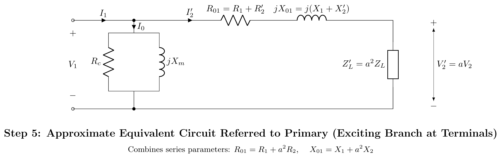

# T-04: Equivalent Circuit

**ECE 2207 — Explanation Answers (Sorted by Topic)**

> **Topic Overview:** This document compiles all semester final questions and explanation answers on **Equivalent Circuit** from 7 years of exams (2017–2024).
> Repeated questions appear once with all exam appearances noted.

---

### T-04: Development of the Transformer Equivalent Circuit

*Appears in: 2020 Q1(b), 2020 Q3(c), 2024 Q4(c)*

#### Why an equivalent circuit is needed
A real transformer consists of two electrically isolated circuits coupled only by an alternating magnetic field. To calculate currents, voltages, power loss, and regulation using standard circuit analysis techniques (KVL, KCL, Thevenin theorem), we must convert the magnetically coupled physical device into a purely electrical, single-mesh or two-mesh circuit model.

A practical two-winding transformer deviates from an ideal transformer due to four physical phenomena:
1. **Winding Resistances**: Finite conductivity of copper causes $I^2 R$ heat loss in primary ($R_1$) and secondary ($R_2$) windings.
2. **Leakage Fluxes**: Primary and secondary leakage fluxes ($\Phi_{l1}, \Phi_{l2}$) travel through air/insulation paths and induce reactive voltage drops ($X_1, X_2$).
3. **Core Excitation & Iron Losses**: The ferromagnetic core has finite permeability requiring a magnetizing current ($I_m$), and alternating flux induces hysteresis and eddy-current core losses ($I_c$).
4. **Turns Ratio & Galvanic Isolation**: Windings are electrically isolated with turns ratio $a = N_1/N_2$.

The equivalent circuit is systematically derived through the following 6 sequential steps:

---

#### Step 1: The Ideal Transformer Core Model
We begin with an ideal transformer core having:
- Zero winding resistance ($R_1 = R_2 = 0$)
- Zero leakage flux ($X_1 = X_2 = 0$)
- Infinite core permeability ($\mu_r \to \infty$, hence exciting current $I_0 = 0$)
- Zero core losses ($P_c = 0$)

The relationship between terminal voltages and currents is governed purely by the turns ratio $a = N_1 / N_2$:
$$\frac{E_1}{E_2} = \frac{N_1}{N_2} = a, \quad \frac{I_1}{I_2} = \frac{N_2}{N_1} = \frac{1}{a}$$

---

#### Step 2: Incorporating Winding Resistances and Leakage Reactances
In a practical transformer, copper conductors possess finite resistance and leakage flux induces reactive back-EMFs:
- **Primary winding**: Series resistance $R_1$ and leakage reactance $X_1 = 2\pi f L_{l1}$.
- **Secondary winding**: Series resistance $R_2$ and leakage reactance $X_2 = 2\pi f L_{l2}$.

Applying Kirchhoff's Voltage Law (KVL) to both sides:
$$\mathbf{V}_1 = \mathbf{E}_1 + \mathbf{I}_1 (R_1 + jX_1)$$
$$\mathbf{E}_2 = \mathbf{V}_2 + \mathbf{I}_2 (R_2 + jX_2)$$

The core itself is still modeled as an ideal transformer coupling induced EMFs $E_1$ and $E_2$.

---

#### Step 3: Adding the Core Excitation Shunt Branch ($R_c \parallel jX_m$)
A real ferromagnetic core draws an exciting current $\mathbf{I}_0$ even under no-load conditions ($I_2 = 0$). This exciting current is modeled as a parallel shunt branch connected across the primary induced EMF $\mathbf{E}_1$:
$$\mathbf{I}_0 = \mathbf{I}_c + \mathbf{I}_m$$

1. **Core-loss resistance $R_c$**: Models real iron losses (hysteresis + eddy current) dissipating active power:
   $$I_c = I_0 \cos \phi_0, \quad R_c = \frac{E_1}{I_c} = \frac{E_1^2}{P_c}$$
2. **Magnetizing reactance $X_m$**: Models reactive VARs required to establish the alternating mutual core flux $\Phi_m$:
   $$I_m = I_0 \sin \phi_0, \quad X_m = \frac{E_1}{I_m}$$

By Kirchhoff's Current Law (KCL) at the primary junction:
$$\mathbf{I}_1 = \mathbf{I}_0 + \mathbf{I}_2'$$
where $\mathbf{I}_2'$ is the load component of primary current counteracting secondary demagnetization.

---

#### Step 4: Transferring Secondary Parameters to Primary Side (Exact Equivalent Circuit)
To obtain a unified single electrical network and eliminate the ideal transformer block, all secondary impedances, voltages, and currents are referred across the boundary to the primary side such that power and volt-ampere balances remain invariant:

1. **Referred secondary voltage and EMF**:
   $$E_2' = a E_2 = E_1, \quad V_2' = a V_2$$
2. **Referred secondary current**:
   $$I_2' = \frac{I_2}{a}$$
3. **Referred winding resistance**:
   $$\text{Copper loss } = I_2^2 R_2 = (I_2')^2 R_2' \implies R_2' = a^2 R_2 = \left(\frac{N_1}{N_2}\right)^2 R_2$$
4. **Referred leakage reactance**:
   $$\text{Reactive VARs } = I_2^2 X_2 = (I_2')^2 X_2' \implies X_2' = a^2 X_2 = \left(\frac{N_1}{N_2}\right)^2 X_2$$
5. **Referred load impedance**:
   $$Z_L' = a^2 Z_L = \left(\frac{N_1}{N_2}\right)^2 Z_L$$

Joining the primary and referred secondary networks at the excitation branch yields the **Complete Exact Equivalent Circuit**:

---

#### Step 5: Approximate Equivalent Circuit Referred to Primary
**Physical Justification**:
- In power and distribution transformers, the exciting current is very small ($I_0 \approx 2\% - 6\%$ of full-load rated current $I_1$).
- The primary series impedance drop $\mathbf{I}_0(R_1 + jX_1)$ is practically negligible ($< 1\%$ of $V_1$).
- Therefore, the voltage across the magnetizing branch is nearly equal to terminal voltage: $\mathbf{E}_1 \approx \mathbf{V}_1$.

Moving the shunt branch ($R_c \parallel jX_m$) directly to the input terminals enables combining the series resistances and leakage reactances into single lumped parameters:
$$R_{01} = R_1 + R_2' = R_1 + a^2 R_2 \quad \text{(Total resistance referred to primary)}$$
$$X_{01} = X_1 + X_2' = X_1 + a^2 X_2 \quad \text{(Total leakage reactance referred to primary)}$$
$$\mathbf{Z}_{01} = R_{01} + jX_{01}$$

---

#### Step 6: Simplified Series Equivalent Circuit (Neglecting $I_0$)
For full-load operation, short-circuit calculations, and voltage regulation determinations:
- The exciting current $I_0$ can be neglected entirely since $I_0 \ll I_2'$.
- The transformer reduces to a simple series impedance $\mathbf{Z}_{01} = R_{01} + jX_{01}$ supplying the referred load $Z_L'$.

$$\mathbf{V}_1 = \mathbf{V}_2' + \mathbf{I}_2'(R_{01} + jX_{01})$$

---

#### Summary of Parameter Transformations (Referred to Primary)

| Parameter | Actual Secondary Value | Transformation Rule | Referred to Primary ($a = N_1/N_2$) |
|:---|:---:|:---:|:---:|
| **Voltage** | $V_2$ | Multiply by $a$ | $V_2' = a V_2$ |
| **Current** | $I_2$ | Divide by $a$ | $I_2' = I_2 / a$ |
| **Resistance** | $R_2$ | Multiply by $a^2$ | $R_2' = a^2 R_2$ |
| **Leakage Reactance** | $X_2$ | Multiply by $a^2$ | $X_2' = a^2 X_2$ |
| **Impedance** | $Z_L$ | Multiply by $a^2$ | $Z_L' = a^2 Z_L$ |
| **Total Equivalent Resistance** | — | $R_1 + R_2'$ | $R_{01} = R_1 + a^2 R_2$ |
| **Total Equivalent Reactance** | — | $X_1 + X_2'$ | $X_{01} = X_1 + a^2 X_2$ |

---

### [2017 Q8(c)]: Numerical analysis using referred equivalent circuit

> 📋 **Appeared in:** 2017 Q8(c)

**Problem:** 200/400V step-up transformer, parameters referred to LV side: $R_{eq} = 0.15\,\Omega$, $X_{eq} = 0.37\,\Omega$, $R_c = 600\,\Omega$, $X_m = 300\,\Omega$. Load: 10A at 0.8 pf lag (secondary). Find: (i) primary current, (ii) secondary terminal voltage.

#### Step-by-step physical solution

**Step 1: Understand the sides.**
- Primary (LV) rated voltage = 200 V.
- Secondary (HV) rated voltage = 400 V.
- Turns ratio $a = N_1 / N_2 = 200 / 400 = 0.5$.
- All given equivalent circuit parameters are already referred to LV (primary) side: $R_{eq} = R_{01} = 0.15\,\Omega$, $X_{eq} = X_{01} = 0.37\,\Omega$, $R_c = 600\,\Omega$, $X_m = 300\,\Omega$.

**Step 2: Refer secondary load to primary.**
- Secondary load current $I_2 = 10\text{ A}$ at $\cos\phi = 0.8$ lagging ($\theta = -36.87°$).
- Referred load current on primary side:
  $$I_2' = \frac{I_2}{a} = \frac{10}{0.5} = 20\text{ A}$$
  $$\vec{I}_2' = 20(0.8 - j0.6) = 16 - j12\text{ A}$$

**Step 3: Calculate primary terminal voltage for rated secondary voltage.**
Taking referred secondary voltage $\vec{V}_2' = 200\angle 0°\text{ V}$ as reference:
$$\vec{V}_1 = \vec{V}_2' + \vec{I}_2'(R_{01} + jX_{01})$$
$$\vec{I}_2'(R_{01} + jX_{01}) = (16 - j12)(0.15 + j0.37) = 2.4 + j5.92 - j1.8 + 4.44 = 6.84 + j4.12\text{ V}$$
$$\vec{V}_1 = (200 + 6.84) + j4.12 = 206.84 + j4.12\text{ V}$$
$$|V_1| = \sqrt{206.84^2 + 4.12^2} \approx 206.88\text{ V}$$

**Step 4: Calculate no-load excitation current.**
The shunt branch is connected across $V_1$:
$$I_c = \frac{V_1}{R_c} = \frac{206.88}{600} \approx 0.345\text{ A}$$
$$I_m = \frac{V_1}{X_m} = \frac{206.88}{300} \approx 0.690\text{ A}$$
$$\vec{I}_0 = 0.345 - j0.690\text{ A}$$

**Step 5: Total primary current.**
$$\vec{I}_1 = \vec{I}_0 + \vec{I}_2' = (0.345 - j0.690) + (16 - j12) = 16.345 - j12.69\text{ A}$$
$$|I_1| = \sqrt{16.345^2 + (-12.69)^2} = \sqrt{267.16 + 161.04} = \sqrt{428.2} \approx \boxed{20.70\text{ A}}$$

**Step 6: Secondary terminal voltage.**
Referred back to secondary side:
$$V_2 = \frac{V_2'}{a} = \frac{200}{0.5} = \boxed{400\text{ V}}$$

---
