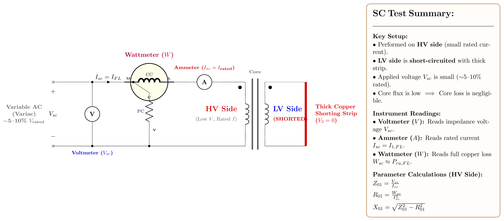

[← T-05: Voltage Regulation](T-05_Voltage_Regulation.md) | [🏠 Index](README.md) | [T-07: 3-Phase & Open-Delta →](T-07_Three-Phase_Connections_and_Open-Delta.md)

---

# T-06: OC-SC Tests, Efficiency & Losses

**ECE 2207 — Explanation Answers (Sorted by Topic)**

> **Topic Overview:** This document compiles all semester final questions and explanation answers on **OC-SC Tests, Efficiency & Losses** from 7 years of exams (2017–2024).
> Repeated questions appear once with all exam appearances noted.

---

### T-03: Efficiency and All-Day Efficiency

*Appears in: 2018 Q2, 2019 Q4c, 2020 Q3, 2021 Q2, 2023 Q2a*

#### Understanding the loss model

A transformer has two types of losses:

**Iron (core) loss $P_{Fe}$:** Consists of eddy current loss and hysteresis loss. Both depend on flux density in the core. Since $B \propto V/f$, and the supply voltage is nearly constant, iron loss is essentially constant at all loads. Even at midnight when the transformer feeds zero load, the core loss continues: you pay for it 24 hours a day.

**Copper loss $P_{Cu}$:** Proportional to (load current)². At fraction $x$ of full-load current:
$$P_{Cu} = x^2 P_{Cu,FL}$$

At no-load: $P_{Cu} = 0$. At full load: $P_{Cu} = P_{Cu,FL}$.

#### Standard efficiency formula

$$\eta = \frac{xS\cos\phi}{xS\cos\phi + P_{Fe} + x^2 P_{Cu,FL}} \times 100\%$$

#### Maximum efficiency condition

Differentiate $\eta$ with respect to $x$ and set equal to zero:

$$\frac{d\eta}{dx} = 0 \implies P_{Fe} = x^2 P_{Cu,FL}$$

$$\text{i.e., Iron loss} = \text{Copper loss at the operating load}$$

$$x_{opt} = \sqrt{\frac{P_{Fe}}{P_{Cu,FL}}}$$

For a transformer with $P_{Fe} = P_{Cu,FL}$, maximum efficiency occurs at full load ($x = 1$). For distribution transformers where $P_{Fe} < P_{Cu,FL}$, maximum efficiency occurs at partial load (typically 60–75% of full load), because distribution transformers spend most hours at light load.

#### All-day efficiency

All-day efficiency accounts for the reality that a distribution transformer operates at varying loads through the day:

$$\eta_{\text{all-day}} = \frac{\text{Total kWh output in 24h}}{\text{Total kWh output + Total losses in 24h}} \times 100\%$$

The key difference from instantaneous efficiency is the iron loss term:

$$\text{Iron loss energy} = P_{Fe} \times 24 \text{ kWh}$$

Iron loss energy is always 24 hours worth, because the transformer is energized all day. Copper loss energy varies with load.

#### Worked example: 2023 Q2a

100 kVA transformer: $P_{Fe} = 1$ kW, $P_{Cu,FL} = 1$ kW. Profile: 4h no-load, 12h half-load, 8h full-load.

**Energy output:**
$0 + 50 \times 12 + 100 \times 8 = 0 + 600 + 800 = 1400$ kWh

**Iron loss:** $1 \times 24 = 24$ kWh

**Copper loss:**
$0 + (0.5)^2 \times 1 \times 12 + 1^2 \times 1 \times 8 = 0 + 3 + 8 = 11$ kWh

**All-day efficiency:**
$$\eta = \frac{1400}{1400 + 24 + 11} \times 100 = \frac{1400}{1435} \times 100 = 97.56\%$$

**Why is all-day efficiency less than full-load efficiency?** Because during the 4 hours of no-load, the transformer still consumes 4 kWh of iron losses for zero output. These are wasted hours from the efficiency perspective. A transformer designed for a light-load profile should have lower iron loss (use higher-grade core material) even if it means slightly higher copper loss.

---

---

### Question 5(c): Efficiency calculations: 25 kVA transformer

> 📋 **Appeared in:** 2017 Q5(c)

#### Setting up the efficiency formula

Transformer efficiency is defined as:
$$\eta = \frac{\text{Output power}}{\text{Input power}} = \frac{P_{\text{out}}}{P_{\text{out}} + P_{\text{losses}}}$$

For a transformer, there are exactly two types of losses:
- **Iron loss $P_{Fe}$:** Constant at all loads (depends only on voltage, which is fixed).
- **Copper loss $P_{Cu}$:** Proportional to load current squared. At fraction $x$ of full load, $P_{Cu} = x^2 P_{Cu,FL}$.

**Given:** $S = 25$ kVA, $P_{Fe} = 350$ W, $P_{Cu,FL} = 400$ W.

#### Full load calculations

At full load, the transformer delivers $S \times \cos\phi$ watts of real power.

**At unity pf ($\cos\phi = 1$):**

$$P_{\text{out}} = 25000 \times 1.0 = 25000 \text{ W}$$

$$\eta = \frac{25000}{25000 + 350 + 400} = \frac{25000}{25750} = 0.9709 = \boxed{97.09\%}$$

**At 0.8 pf lagging:**

$$P_{\text{out}} = 25000 \times 0.8 = 20000 \text{ W}$$

$$\eta = \frac{20000}{20000 + 350 + 400} = \frac{20000}{20750} = 0.9639 = \boxed{96.39\%}$$

Why is efficiency lower at 0.8 pf? The losses are the same (350 + 400 W), but the output power is less (20 kW instead of 25 kW). So losses take a bigger percentage of the input.

#### Half load calculations

At half load ($x = 0.5$):
- Output: $S \times x \times \cos\phi = 25000 \times 0.5 \times \cos\phi$
- Iron loss: Still 350 W (voltage is still rated)
- Copper loss: $(0.5)^2 \times 400 = 0.25 \times 400 = 100$ W

**At unity pf:**

$$\eta = \frac{12500}{12500 + 350 + 100} = \frac{12500}{12950} = 0.9653 = \boxed{96.53\%}$$

**At 0.8 pf:**

$$\eta = \frac{10000}{10000 + 350 + 100} = \frac{10000}{10450} = 0.9569 = \boxed{95.69\%}$$

**Notice:** Half-load efficiency at unity pf (96.53%) is actually slightly less than full-load unity pf efficiency (97.09%). This is because at half load, the iron loss (350 W) is proportionally larger compared to the output (12.5 kW) than at full load. Maximum efficiency occurs when copper loss = iron loss, i.e., at load fraction $x = \sqrt{350/400} = 0.935$ = 93.5% of full load.

---

> **Note:** This file covers selected key questions in full explanation style. The remaining questions from 2017 follow the same principles as explained in corresponding sections in 2018–2024 explanation files.

---

### Q2(b): All-day efficiency: 10kVA transformer with 24hr load profile

> 📋 **Appeared in:** 2018 Q2(b)

#### Setup

$S = 10$ kVA, $P_{Fe} = 200$ W (from no-load test), $P_{Cu,FL} = 300$ W.

Load profile (not given in 2018: this is from the general principle; see example below for a hypothetical).

For any all-day efficiency problem, the procedure is:

1. Calculate energy output per period: $\text{kWh} = \text{kW} \times \text{hours}$
2. Iron loss energy = $P_{Fe} \times 24$ hours (always runs 24h)
3. Copper loss energy = $\sum_i (x_i)^2 \times P_{Cu,FL} \times t_i$ where $x_i$ is load fraction in period $i$
4. $\eta = \text{Output}/ (\text{Output} + \text{All losses})$

**Key insight:** Iron losses accumulate even during no-load hours. This penalizes transformers in low-load-factor systems. Distribution transformers are deliberately designed with low iron loss for this reason.

---

---

### Q3(a): Why OC and SC tests are preferred over direct load test

> 📋 **Appeared in:** 2023 Q3(a), 2024 Q3

#### The problem with direct load testing

Imagine trying to test a 500 kVA distribution transformer. A "direct load test" would mean:
- Arrange a load bank of 500 kVA: banks of resistors, inductors, capacitors. This equipment costs a lot and takes up a large room.
- Feed 500 kW continuously through the transformer for hours while measuring.
- The power wasted during the test: if efficiency is 97%, you'd burn 15 kW of losses for every hour: substantial cost and heat.
- You can only test at one specific load and power factor at a time.

For a 1000 MVA power station transformer, a direct load test would require a 1000 MW load: essentially another power station.

#### What OC and SC tests do instead

**OC test:** Apply rated voltage to the LV winding (HV open), measure only no-load current (2–5% of rated). Power consumed = iron losses only (about 0.3–0.5% of rated kVA). For a 500 kVA transformer: test power ≈ 1.5–2.5 kW. Tiny.

**SC test:** Apply 5–10% of rated voltage to the HV winding (LV solidly short-circuited with a thick copper bar to circulate rated full-load current). Power consumed = copper losses only (about 0.8–1.5% of rated kVA). Again tiny.

**From two simple, low-power tests, you get:**
- Core loss $P_{Fe}$ (from OC test)
- Full-load copper loss $P_{Cu,FL}$ (from SC test)
- All four equivalent circuit parameters ($R_c$, $X_m$, $R_{01}$, $X_{01}$)
- Efficiency at any load and any power factor (by formula)
- Voltage regulation at any load and any power factor (by formula)

The key insight: **efficiency and VR are calculated analytically using the measured parameters: you don't need to actually apply the loads.**

---

[← T-05: Voltage Regulation](T-05_Voltage_Regulation.md) | [🏠 Index](README.md) | [T-07: 3-Phase & Open-Delta →](T-07_Three-Phase_Connections_and_Open-Delta.md)
