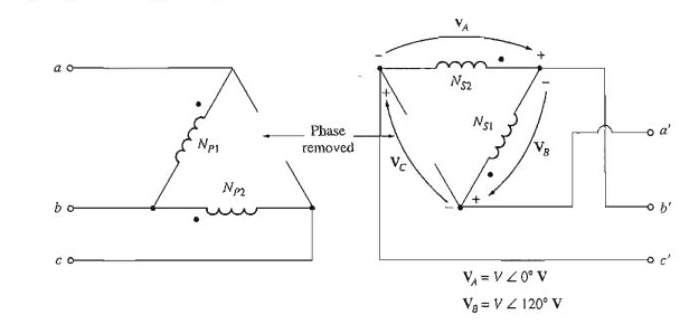
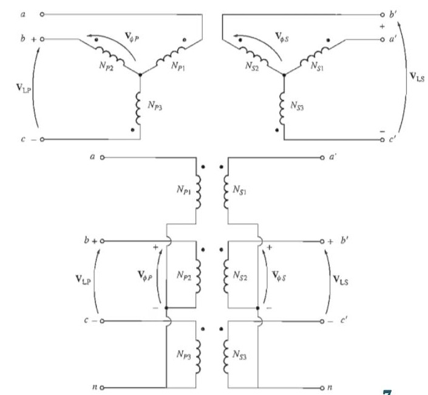

# T-07: Three-Phase Connections & Open-Delta

**ECE 2207 — Explanation Answers (Sorted by Topic)**

> **Topic Overview:** This document compiles all semester final questions and explanation answers on **Three-Phase Connections & Open-Delta** from 7 years of exams (2017–2024).
> Repeated questions appear once with all exam appearances noted.

---

### T-04: Open-Delta Connection: Why 57.7% and When to Use It

*Appears in: 2018 Q4c, 2019 Q3b, 2020 Q4b, 2021 Q3b, 2023 Q4a*

#### The scenario

You have a 3-phase Δ-Δ transformer bank with three single-phase units. One fails overnight. You cannot shut down the system. Can you continue serving the 3-phase load? Yes: using open-delta.

#### Why three-phase voltage remains balanced

Remove transformer $T_{CA}$ from the bank. Transformers $T_{AB}$ and $T_{BC}$ remain.

On the primary (supply) side: The 3-phase supply maintains $V_{AB}$ and $V_{BC}$ (two of the three line voltages). By KVL around the delta loop:
$$V_{CA} + V_{AB} + V_{BC} = 0 \implies V_{CA} = -(V_{AB} + V_{BC})$$

This voltage $V_{CA}$ is the third line voltage, and it is **automatically determined** by the other two. The 3-phase supply is balanced, so $V_{CA}$ is perfectly balanced with $V_{AB}$ and $V_{BC}$.

On the secondary (load) side: Each remaining transformer has a secondary EMF proportional to its primary voltage × turns ratio $K$. So:
$V_{ab} = K \cdot V_{AB}$, $V_{bc} = K \cdot V_{BC}$.

By KVL on the secondary side:
$$V_{ca} = -(V_{ab} + V_{bc}) = K \cdot V_{CA}$$

All three secondary line voltages are present and balanced. The load sees a balanced 3-phase supply.

#### Why capacity drops to 57.7%

**Closed-Δ (3 transformers):** Each transformer rated $S = VI$ kVA. Total = $3S$.

**Open-Δ (2 transformers):** Each transformer still handles its rated current $I$ and rated voltage $V$. Each transformer's instantaneous power output alternates. For a balanced load with unity power factor, the effective power from each transformer:

Think about it geometrically. In a balanced 3-phase system, the voltages are 120° apart. When two transformers supply a balanced load, the phase angles of their voltage-current products are not both at unity power factor: they are at $+30°$ and $-30°$ from unity:
- Transformer 1 operates at power factor $\cos 30° = \sqrt{3}/2 = 0.866$
- Transformer 2 operates at power factor $\cos 30° = 0.866$ (by symmetry)

Each delivers power: $V \times I \times 0.866 = 0.866 S$

Total open-Δ power $= 2 \times 0.866 S = \sqrt{3} S$

$$\frac{S_{\text{open}}}{S_{\text{closed}}} = \frac{\sqrt{3}S}{3S} = \frac{1}{\sqrt{3}} = 0.577 = 57.7\%$$

#### Utilization factor

Each transformer is rated $S$ kVA but works at $0.866 S$ kW useful power. The transformer's KVA product ($VI$) is at its rated value, but only $86.6\%$ of it goes to real power (the rest is reactive). So the transformer is 86.6% utilized: not 100%.

#### When to use it

1. Emergency operation when one transformer fails.
2. During maintenance (remove one transformer, keep supply going).
3. For initial low-cost installation where future load growth is expected (start with two, add third later).

---

## Induction Motor Topics (2018–2024)

---

### Q3(a): Limitations of Y-Y transformer: the third harmonic problem

> 📋 **Appeared in:** 2021 Q3(a)

#### Why third harmonics exist in transformer cores

Transformer cores are made of ferromagnetic material. The B-H curve of iron is non-linear (it saturates). This means the magnetizing current needed to produce a sinusoidal flux is not itself sinusoidal: it contains third, fifth, and higher harmonics.

In particular, to produce a sinusoidal core flux at 50 Hz, the magnetizing current must be rich in third harmonics (150 Hz components). This is just the physics of ferromagnetic magnetization.

#### How Y-Y connection blocks third harmonics

In a balanced 3-phase system, third harmonic currents are "zero-sequence": all three phases have the same phase angle at the third harmonic frequency. They want to flow in or out of all three phases simultaneously.

In a Y-Y connected transformer without a grounded neutral: zero-sequence currents have no return path. They cannot flow. The third harmonic magnetizing currents are suppressed.

**Consequence:** Since the magnetizing current can only be sinusoidal (no third harmonics allowed), the core flux is no longer sinusoidal. The flux becomes "peaked" (its waveform becomes distorted: similar to a square wave peak). A peaked flux induces a peaked (distorted) EMF in the windings.

The phase-to-neutral voltage (line-to-neutral voltage) contains third harmonic components. The line-to-line voltages are unaffected (third harmonics cancel in line-to-line differences), but the neutral point "floats" and the neutral voltage contains harmonics.

#### Solutions

1. **Ground the neutral (4-wire Y-Yn):** Third harmonic currents flow through the grounded neutral. Flux remains sinusoidal. No harmonic voltages.

2. **Delta-connected tertiary:** Add a delta-connected third winding. The closed delta provides a circulating path for third harmonic currents. Suppresses harmonic voltages without needing a grounded neutral. Very commonly used in large power transformers.

3. **Avoid Y-Y altogether:** Use Y-Δ or Δ-Y. The delta side always provides a path for third harmonic circulation.

---

