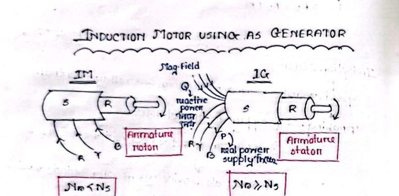

[← T-12: Rotating Magnetic Field](T-12_Rotating_Magnetic_Field.md) | [🏠 Index](README.md) | [T-14: IM as Rotating Transformer →](T-14_IM_as_Rotating_Transformer.md)

---

# T-13: Slip, Synchronous Speed & Basics

**ECE 2207 — Explanation Answers (Sorted by Topic)**

> **Topic Overview:** This document compiles all semester final questions and explanation answers on **Slip, Synchronous Speed & Basics** from 7 years of exams (2017–2024).
> Repeated questions appear once with all exam appearances noted.

---

---

### [2017 Q1(c) / 2023 Q5(b) / 2024 Q5(b)]: Definition of Slip & Proof that Induction Motor Cannot Run at Synchronous Speed

> 📋 **Appeared in:** 2017 Q1(c), 2023 Q5(b), 2024 Q5(b) (Years: 2017, 2023, 2024)

**(b) Define slip. Prove that an induction motor cannot run at synchronous speed. [Marks: 03, CO: 3]**

#### 1. Definition of Slip
In an induction motor, the stator winding produces a magnetic field rotating at synchronous speed:
$$N_s = \frac{120 f}{P}\ \text{rpm}$$
The rotor rotates in the same direction at actual mechanical speed $N$ (where $N < N_s$ in motoring mode).

- **Slip Speed:** The difference in speed between the stator rotating magnetic field (RMF) and the mechanical rotor:
  $$\text{Slip Speed} = N_s - N\ \text{rpm}$$
- **Fractional Slip ($s$):** The ratio of slip speed to synchronous speed:
  $$s = \frac{N_s - N}{N_s}$$
- **Percentage Slip ($\%s$):**
  $$\%s = \frac{N_s - N}{N_s} \times 100\%$$
- **Rotor Frequency ($f_r$):** The frequency of currents induced in the rotor winding is directly proportional to slip:
  $$f_r = s f$$
  At standstill ($N = 0$), $s = 1$ and $f_r = f$. At normal running ($s \approx 2\%\text{–}5\%$), $f_r$ is only $1\text{–}2.5\text{ Hz}$.

---

#### 2. Proof: An Induction Motor Cannot Run at Synchronous Speed

To prove that $N < N_s$ strictly, suppose by contradiction that the rotor could accelerate to and sustain synchronous speed ($N = N_s$):

1. **Relative Velocity Becomes Zero:**
   The relative velocity between the stator rotating magnetic field and the rotor conductors is:
   $$v_{\text{rel}} = N_s - N = N_s - N_s = 0$$

2. **Induced Rotor EMF Vanishes:**
   In accordance with Faraday's Law of Electromagnetic Induction ($e = B l v_{\text{rel}}$), electromagnetic induction requires relative cutting of flux. When $v_{\text{rel}} = 0$, no magnetic lines of force cut the rotor bars:
   $$E_{2r} = s E_2 = 0 \times E_2 = 0\ \text{V}$$

3. **Rotor Current Drops to Zero:**
   With zero induced voltage in the closed rotor circuit:
   $$I_{2r} = \frac{E_{2r}}{\sqrt{R_2^2 + (s X_2)^2}} = \frac{0}{\sqrt{R_2^2 + 0^2}} = 0\ \text{A}$$

4. **Electromagnetic Torque Collapses to Zero:**
   By Lorentz force ($F = B I l$) and torque relation:
   $$T = k \Phi I_{2r} \cos\phi_2 = 0\ \text{N}\cdot\text{m}$$

5. **Mechanical Deceleration:**
   Even if the motor has no external shaft load, internal mechanical friction (bearing friction) and aerodynamic windage resistance are always present. In the absence of forward electromagnetic driving torque ($T = 0$), the retarding forces immediately cause the rotor to decelerate ($N < N_s$).

6. **Restoration of Induction Action:**
   The instant $N$ drops below $N_s$, slip becomes positive ($s > 0$). Relative motion reappears, EMF is induced, rotor currents circulate, and positive electromagnetic torque is re-established to balance friction and load.

$$\boxed{\text{Hence, an induction motor can NEVER sustain synchronous speed. It must always operate as an asynchronous machine } (N < N_s, s > 0).}$$

#### Special Case Illustration [2017 Q1(c)]: 6-Pole, 50 Hz Motor Driven at 1000 rpm
- Synchronous speed: $N_s = \frac{120 \times 50}{6} = 1000\text{ rpm}$.
- If driven externally at exactly $N = 1000\text{ rpm}$, slip $s = 0$, $f_r = 0\text{ Hz}$, $E_{2r} = 0$, and electromagnetic torque $T = 0$.
- If driven by a prime mover *above* $1000\text{ rpm}$ ($N > N_s$), slip becomes negative ($s < 0$), rotor induced current reverses phase, developed torque opposes rotation, and the machine operates as an **Induction Generator**, feeding electrical power back into the AC supply grid.

---

### [2024 Q5(c)]: Worked Numerical Problem — Induction Motor Supplied by Alternator

> 📋 **Appeared in:** 2024 Q5(c)

**Problem:** A 12 pole, 3-$\varphi$ alternator driven at a speed of 500 r.p.m supplies power to an 8-pole, 3-$\varphi$ induction motor. If the slip of the motor at full load is 3%, calculate the full-load speed of the motor.

#### Step-by-Step Solution

**Given:**
- Alternator: $P_{\text{alt}} = 12\text{ poles}$, speed $N_{\text{alt}} = 500\text{ rpm}$
- Induction motor: $P_{\text{motor}} = 8\text{ poles}$, full-load slip $s = 3\% = 0.03$

**Step 1: Frequency generated by alternator**
An alternator with $P$ poles running at $N$ rpm generates frequency:
$$f = \frac{P_{\text{alt}} N_{\text{alt}}}{120} = \frac{12 \times 500}{120} = \frac{6000}{120} = \mathbf{50\text{ Hz}}$$

**Step 2: Synchronous speed of the 8-pole motor**
Fed from this 50 Hz supply, the stator rotating magnetic field turns at:
$$N_s = \frac{120 f}{P_{\text{motor}}} = \frac{120 \times 50}{8} = \frac{6000}{8} = \mathbf{750\text{ rpm}}$$

**Step 3: Full-load rotor speed**
With full-load slip $s = 0.03$:
$$N_{FL} = N_s(1 - s) = 750 \times (1 - 0.03) = 750 \times 0.97 = \mathbf{727.5\text{ rpm}}$$

$$\boxed{N_{FL} = 727.5\text{ rpm}}$$

---

[← T-12: Rotating Magnetic Field](T-12_Rotating_Magnetic_Field.md) | [🏠 Index](README.md) | [T-14: IM as Rotating Transformer →](T-14_IM_as_Rotating_Transformer.md)
