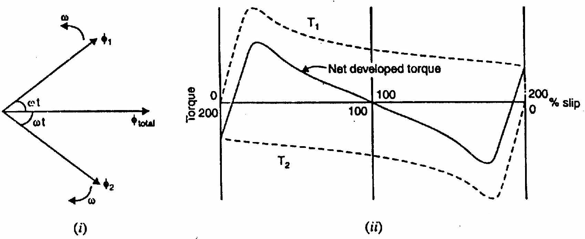

[← T-21: Induction Generator](T-21_Induction_Generator.md) | [🏠 Index](README.md) | [T-23: 1-Phase Starting Methods →](T-23_Single-Phase_IM_Starting_Methods.md)

---

# T-22: Single-Phase IM Theory (DFRT)

**ECE 2207 — Explanation Answers (Sorted by Topic)**

> **Topic Overview:** This document compiles all semester final questions and explanation answers on **Single-Phase IM Theory (DFRT)** from 7 years of exams (2017–2024).
> Repeated questions appear once with all exam appearances noted.

---

### IM-03: Double-Field Revolving Theory: Why 1-Phase IM is Not Self-Starting

*Appears in: 2018 Q8a, 2019 Q8b, 2020 Q8c, 2021 Q7a, 2023 Q8a, 2024 Q8a*

#### The problem with single-phase

A 3-phase motor works because three windings, spatially displaced and phase-displaced in time, create a smoothly rotating field. Remove two phases and you have a single-phase winding that creates a pulsating (not rotating) field.

A pulsating field is different from a rotating field. It alternates back and forth along one axis. The question is: can this pulsating field still drive a rotor?

#### Ferraris' key insight (1885)

Italian physicist Galileo Ferraris showed that any pulsating magnetic field can be decomposed into two equal counter-rotating fields.

Mathematically:
$$\Phi = \Phi_m\sin\omega t$$

Can be written as:
$$\Phi = \frac{\Phi_m}{2}\cos(\omega t - \alpha) + \frac{\Phi_m}{2}\cos(\omega t + \alpha)$$

where $\alpha$ is the spatial angle. The first term rotates forward (counter-clockwise, say), the second rotates backward (clockwise). Each has magnitude $\Phi_m/2$.

At any instant, the two counter-rotating phasors add up to give the original pulsating field along the axis.

#### Effect on the rotor: at standstill

Consider the forward-rotating field $\Phi_f = \Phi_m/2$ rotating at $+N_s$.

For the squirrel-cage rotor at rest ($N = 0$): The forward field sees slip $s_f = (N_s - 0)/N_s = 1$.

This field induces rotor currents and produces a forward torque $T_f$. This is exactly like a 3-phase motor at standstill: with the rotor field at slip 1.

Now consider the backward-rotating field $\Phi_b = \Phi_m/2$ rotating at $-N_s$.

For a stationary rotor, the backward field also sees a slip of 1 (it moves at $-N_s$ relative to the ground, and the rotor is at rest, so relative speed $= N_s$).

The backward field produces a backward torque $T_b$, equal in magnitude to $T_f$ (same slip, same rotor impedance).

**Net torque at standstill:** $T = T_f - T_b = 0$.

No starting torque. The motor just sits there.

#### Once you give it a push

Suppose you push the rotor to speed $N$ in the forward direction.

**Forward field slip:** $s_f = (N_s - N)/N_s = s$ (say $s = 0.05$ for running speed)

**Backward field slip:** The backward field rotates at $-N_s$. The rotor is at $+N$. Relative speed $= -N_s - N = -(N_s + N)$. So:
$$s_b = \frac{N_s + N}{N_s} = 1 + (1-s) = 2 - s$$

For $s = 0.05$: $s_b = 1.95$.

Now look at the torque-slip curve:
- Forward field: slip = 0.05 (well below peak, in the high-torque stable region). $T_f$ is large.
- Backward field: slip = 1.95 (past the peak, in the low-torque unstable region). $T_b$ is small.

**Net torque $= T_f - T_b > 0$**: The motor keeps accelerating and reaches a stable running speed.

**Conclusion:**
- At standstill: $T_f = T_b$, net = 0. Motor cannot start itself.
- Once running: $T_f > T_b$, net forward torque. Motor maintains speed.
- The direction of running depends on which way you push. The motor "doesn't care" which direction: it will run in whatever direction it was started.

#### Quantitative torque expression

Combining forward and backward torques:
$$T = T_f(s) - T_b(2-s)$$

where:
$$T_f(s) = \frac{k_1 s}{R_2^2 + s^2X_2^2} \cdot R_2$$

$$T_b(2-s) = \frac{k_1(2-s)}{R_2^2 + (2-s)^2X_2^2} \cdot R_2$$

At $s = 1$: these two are equal. At $s < 1$ (forward rotation): $T_f > T_b$ in typical motors.

---

[← T-21: Induction Generator](T-21_Induction_Generator.md) | [🏠 Index](README.md) | [T-23: 1-Phase Starting Methods →](T-23_Single-Phase_IM_Starting_Methods.md)
