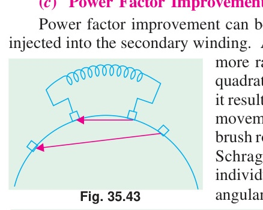

[← T-24: Single Phasing](T-24_Single_Phasing.md) | [🏠 Index](README.md) | *(end)*

---

# T-25: Miscellaneous IM Topics

**ECE 2207 — Explanation Answers (Sorted by Topic)**

> **Topic Overview:** This document compiles all semester final questions and explanation answers on **Miscellaneous IM Topics** from 7 years of exams (2017–2024).
> Repeated questions appear once with all exam appearances noted.

---

### Q4(b): How magnetic fields are generated: from different methods

> 📋 **Appeared in:** 2021 Q4(b)

#### The microscopic picture

Magnetic fields arise from moving charges (currents). In a permanent magnet, electron spin (intrinsic angular momentum) creates microscopic current loops within atoms. These align in magnetic domains. In electromagnets, macroscopic conduction current through a conductor creates the field.

****Fundamental source:** $\nabla \times \vec{B} = \mu_0 \vec{J}$ (Ampere's Law). The curl of the magnetic field equals the current density.

For windings: the "current density" is concentrated in the wire conductors, and the iron core channels the resulting flux.

#### Why 3-phase produces a better field than single-phase

Single-phase: one winding, one pulsating field. Cannot rotate by itself.

Two-phase: two windings at 90°, two currents at 90° in time. Resultant magnitude $\Phi_m$ (constant). Smooth rotation.

Three-phase: three windings at 120°, three currents at 120° in time. Resultant magnitude $1.5\Phi_m$ (constant). Smooth rotation. Three-phase is preferred industrially because the winding copper is more efficiently used (each winding is active most of the cycle) and the phase arrangement gives balanced current draw from the supply.

---

## Induction Motor Topics

---

### Q6(b): Improving power factor of IM at light loads

> 📋 **Practice problem (not from a past paper)**

#### Why power factor is poor at light loads

An induction motor's stator current has two components:
1. **Active (working) component $I_c$:** Provides the torque-producing energy. Proportional to mechanical load.
2. **Reactive (magnetizing) component $I_m$:** Magnetizes the air gap. Nearly constant at all loads (flux must be maintained).

Power factor: $\cos\phi = I_c/I = I_c/\sqrt{I_c^2 + I_m^2}$

At full load: $I_c$ is large. $\cos\phi$ is high (0.80–0.90).
At light load: $I_c$ is small (little torque needed). $I_m$ dominates. $\cos\phi$ drops to 0.3–0.5.
At no-load: $I_c \approx 0$, $I_m$ dominates entirely. $\cos\phi \approx 0.1$.

#### Why this matters at the system level

The electricity bill for industrial users typically has two components:
- Energy charge (kWh used)
- Demand charge (based on maximum kVA demand, which includes reactive current)

Poor power factor inflates the kVA demand without adding to the kWh output. The utility must supply extra reactive current through transformers, cables, and generators: all of which have resistive losses. These losses are not paid for by the user (unless there's a power factor penalty clause).

#### The capacitor solution: why it works

A capacitor bank connected at the motor terminals draws **leading** reactive current. This leading current directly cancels the lagging magnetizing current of the motor. From the supply's perspective, the motor + capacitor combination draws much less reactive current.

The capacitor does not change the motor's internal operation: it still has the same slip, speed, and torque. It simply eliminates the need for the supply to provide magnetizing current, because the capacitor provides it locally.

---

[← T-24: Single Phasing](T-24_Single_Phasing.md) | [🏠 Index](README.md) | *(end)*
